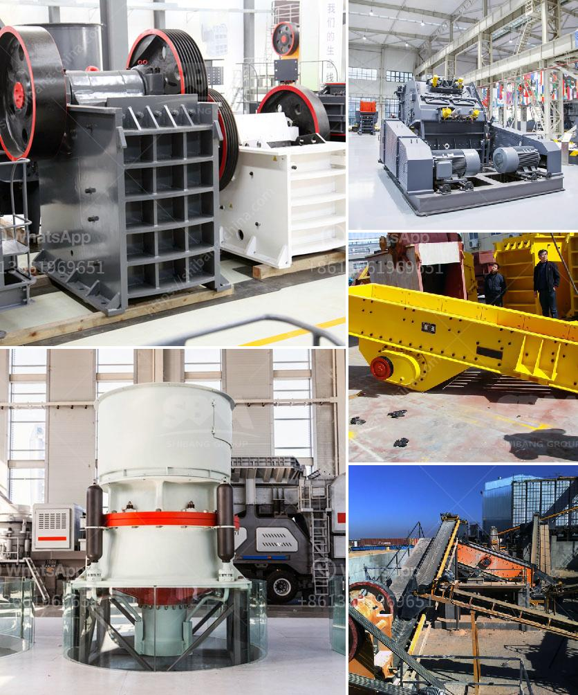

<h3>used limestone pulverizers crusher for sale texas</h3>
If you are looking for a limestone pulverizer, then Pioneer Group has got you covered! We offer both new and used limestone pulverizers, all at competitive prices. We understand the importance of finding the right pulverizer to suit your specific needs, and we are here to help.

Limestone is a sedimentary rock that is mainly composed of calcium carbonate (CaCO3). It is widely used in the construction industry as a building material and as a raw material for making cement. To extract limestone, it needs to be crushed into small pieces before being used in various applications.

A limestone pulverizer is used to grind the limestone into a fine powder, which is used as a filler in several industries. The pulverizer is also used as a raw material crusher for cement plants as it makes the process of extracting limestone from the mines easier and efficient.

Limestone deposits can be found in various parts of the world, including Texas. As such, our limestone pulverizers for sale in Texas come in different sizes and types. Our fleet of used pulverizers features both horizontal and vertical models, giving you the flexibility to choose the one that best suits your needs.

Our pulverizers are built to last, with sturdy materials and a robust design. They are engineered to deliver optimal performance and handle even the toughest limestone materials. Each pulverizer is thoroughly tested before being put up for sale to ensure it meets our high standards of quality and reliability.

When purchasing a used limestone pulverizer crusher, it is essential to choose a trustworthy supplier like Pioneer Group. We have been in the construction industry for years and have established a solid reputation for providing top-notch equipment. Our team of experts will guide you through the selection process, helping you find the right pulverizer for your specific requirements.

In addition to offering used limestone pulverizers for sale, we also provide comprehensive after-sales support. Our dedicated team of technicians is available to assist you with any technical issues or concerns you may have. We understand the importance of keeping your equipment in optimal condition for maximum efficiency and productivity.

At Pioneer Group, we are committed to customer satisfaction. We believe in building long-term relationships with our clients by providing them with high-quality equipment and exceptional service. Whether you are a small construction firm or a large cement plant, you can rely on us for all your pulverizer needs.

In conclusion, if you are in the market for a used limestone pulverizer crusher in Texas, look no further than Pioneer Group. With our extensive range of pulverizers and our commitment to customer satisfaction, we are confident that we can meet all your limestone pulverizer needs. Contact us today to find out more about our products and how we can assist you.
<h3>Contact us</h3><ul><li><strong>Whatsapp:&nbsp;<a href="https://wa.me/8613661969651">+8613661969651</a></strong></li><li><a href="https://swt.shibang-china.com/?git&amp;zhl&amp;used limestone pulverizers crusher for sale texas"><strong>Online Service(chat now)</strong></a></li></ul><h3>Related</h3><ul><li><a href='small scale crushing plant.md'>small scale crushing plant</a></li><li><a href='mobile crushing plant hire product.md'>mobile crushing plant hire product</a></li><li><a href='crusher plants for sale in pakistan.md'>crusher plants for sale in pakistan</a></li><li><a href='but concrete crushers nigeria.md'>but concrete crushers nigeria</a></li><li><a href='vertical grinding machine black and dacker.md'>vertical grinding machine black and dacker</a></li></ul>