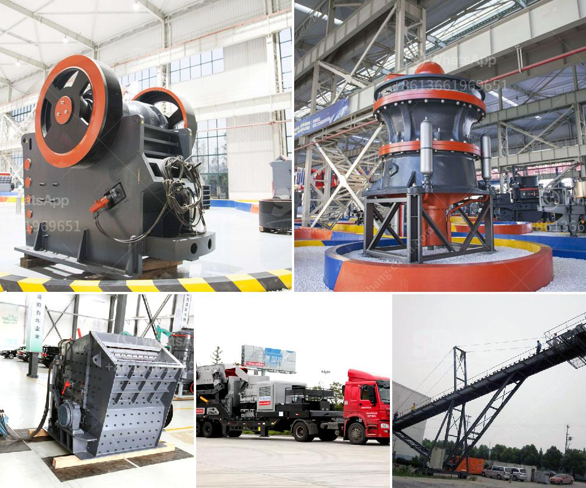

<h3>used mobile crusher in nigeria</h3>
The demand for used mobile crusher in Nigeria is on the rise as a result of the massive growth in the construction industry and infrastructure development in the country. With the rapid urbanization, the country has experienced over the past few decades, there has been a constant need to build new roads, bridges, buildings, and other infrastructure to accommodate the increasing population.

A used mobile crusher is a mobile crushing and screening equipment independently developed by the company to meet the market demand. It is equipped with an integrated feeder, a jaw crusher, a vibrating screen, and a belt conveyor. It can process construction waste, cement concrete, asphalt concrete, and various materials.

One of the main advantages of using a used mobile crusher in Nigeria is the ability to move easily and efficiently around the construction site. This flexibility helps to save time and money by reducing the need for additional equipment and transportation costs. Additionally, the compact design of the mobile crusher allows it to be easily transported to and from the site, making it ideal for both large-scale construction projects and smaller, more remote locations.

Furthermore, a used mobile crusher offers high productivity and low operating costs. The advanced technology and efficient design of these machines ensure that they can handle large volumes of material while consuming less energy. This not only saves money in terms of fuel consumption but also reduces the carbon footprint of the construction industry, making it more environmentally friendly.

In conclusion, the demand for used mobile crushers in Nigeria is driven by the growth in the construction industry and infrastructure development. These machines offer various benefits such as mobility, productivity, and cost-effectiveness. As the country continues to invest in its infrastructure, the demand for used mobile crushers is expected to increase further in the coming years.
<h3>Contact us</h3><ul><li><strong>Whatsapp:&nbsp;<a href="https://wa.me/8613661969651">+8613661969651</a></strong></li><li><a href="https://swt.shibang-china.com/?git&amp;zhl&amp;used mobile crusher in nigeria"><strong>Online Service(chat now)</strong></a></li></ul><h3>Related</h3><ul><li><a href='professional granite cone crusher.md'>professional granite cone crusher</a></li><li><a href='crusher plant for coal.md'>crusher plant for coal</a></li><li><a href='roller crusher for coal.md'>roller crusher for coal</a></li><li><a href='concrete crushing machines.md'>concrete crushing machines</a></li><li><a href='capital cost for iron ore pellet plant in india.md'>capital cost for iron ore pellet plant in india</a></li></ul>