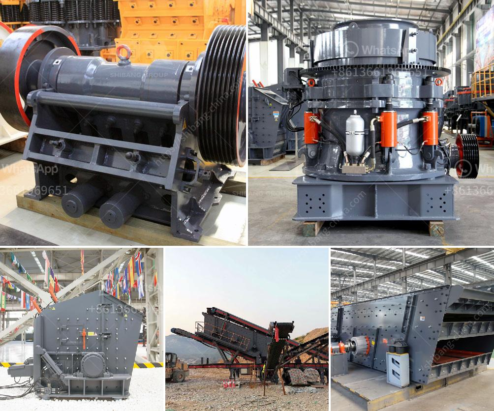

<h3>used mobile crusher</h3>
Over the past decade, the construction industry has been witnessing a significant rise in the number of construction projects. This has led to an increase in the demand for machinery and equipment, resulting in a thriving market for mobile crushers.

A mobile crusher is a versatile machine that can be used in many industries, including mining, quarrying, recycling, and construction. It can break and crush various materials, such as limestone, granite, and concrete for secondary or tertiary crushing applications.

The global mobile crusher market is projected to increase at a CAGR of 7.8% during the forecast period of 2020-2027. The growth in the market is attributed to the increasing construction activities and expansion of the mining industry.

The emergence of technology has enabled the world to become more connected and interdependent. Mobile crushers, therefore, make a significant contribution to the technological advancement in the construction industry. They take advantage of the latest advancements in technology, including GPS trackers, remote monitoring, and diagnostics capabilities, to provide better efficiency and productivity.

One of the key benefits of mobile crushers is their versatility. They can be used in various applications, such as recycling old concrete, asphalt, and construction debris, into reusable aggregates. This eliminates the need for traditional crushing equipment, saving companies both time and money.

Another advantage of mobile crushers is their flexibility in terms of mobilization and demobilization. They can be quickly transported to different job sites, allowing construction companies to easily switch between projects. This not only reduces transportation costs but also improves overall project efficiency.

One type of mobile crusher that has gained popularity in recent years is the tracked impact crusher. These crushers track the material they crush from one location to another, such as a construction site or a quarry. Therefore, they can be easily moved from one location to another, making them an ideal choice for recycling and crushing operations.

Used mobile crushers offer a variety of benefits compared to buying new. With the rising cost of landfill disposal and the shortage of natural resources, recycling concrete debris is becoming more economically viable. Recycling concrete saves natural resources, reduces greenhouse gas emissions, and cuts energy consumption. Used mobile crushers often come with warranties and provide regular maintenance and repair services, making them a more reliable option.

Moreover, buying a used mobile crusher ensures you get a high-quality machine that is already proven to be durable and efficient. Plus, you can save money on the initial purchase, which allows for increased investment in other areas of your construction projects.

In conclusion, used mobile crushers offer the perfect solution for construction companies dealing with leftover concrete debris. By crushing and recycling the concrete, they can reduce disposal costs and save valuable resources. For construction companies of all sizes, buying used mobile crushers is a smart and economical choice that meets their project's specific requirements. With the ongoing advancements in technology, mobile crushers have become an essential part of the construction industry, transforming the way construction waste is handled and recycled.
<h3>Contact us</h3><ul><li><strong>Whatsapp:&nbsp;<a href="https://wa.me/8613661969651">+8613661969651</a></strong></li><li><a href="https://swt.shibang-china.com/?git&amp;zhl&amp;used mobile crusher"><strong>Online Service(chat now)</strong></a></li></ul><h3>Related</h3><ul><li><a href='coal and grinding machine cost.md'>coal and grinding machine cost</a></li><li><a href='equipment used for crushing in activated carbon.md'>equipment used for crushing in activated carbon</a></li><li><a href='crushing machine in philippines.md'>crushing machine in philippines</a></li><li><a href='sand wash plant for sale.md'>sand wash plant for sale</a></li><li><a href='bauxite crusher for sale.md'>bauxite crusher for sale</a></li></ul>