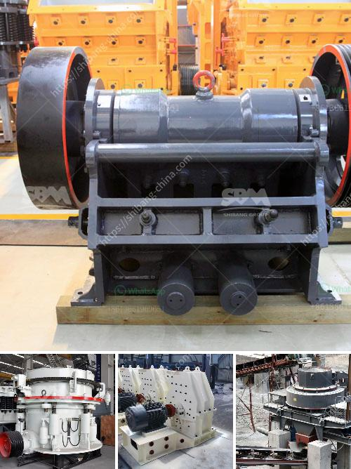

<h3>used mobile jaw crushers for sale in uk</h3>
Used mobile jaw crushers for sale in UK are in high demand, as the construction industry continues to rebound rapidly. These highly versatile machines can be operated by one person, making it convenient for smaller construction companies or subcontractors who do not have a dedicated team for crushing operations.

The primary purpose of a mobile jaw crusher is to reduce the size of large rocks and stones. It utilizes a powerful jaw crusher mechanism that continuously compresses and crushes the material until it is small enough to pass through the gap at the bottom of the jaws. The crushed material can then be reused as-is or further processed for various applications in the construction industry.

One of the main advantages of used mobile jaw crushers is their mobility. They can be easily moved from one site to another, making them suitable for both on-site and off-site crushing operations. This flexibility allows construction companies to save time and money by avoiding the need to transport materials to a stationary crusher.

Used mobile jaw crushers are also cost-effective, as they are typically less expensive than new models. However, it is important to carefully consider the condition and maintenance history of the machine before making a purchase. Reputable sellers will provide detailed information about the crusher's service history, any repairs or refurbishments that have been done, and its overall condition.

When considering a used mobile jaw crusher for sale, it is essential to do some research and ensure that the machine meets your specific requirements. Factors to consider include the size and hardness of the materials you will be crushing, the desired output size, and the capacity of the crusher.

It is also advisable to inspect the machine in person or request a video demonstration to ensure that it is in good working condition. Look for signs of wear and tear, such as worn-out belts or damaged components, as these may indicate potential future issues.

Another crucial aspect to consider when purchasing a used mobile jaw crusher is to check for available spare parts and support from the manufacturer or seller. Ensuring the availability of spare parts will help minimize downtime in case of any breakdowns or repairs.

In conclusion, used mobile jaw crushers for sale in the UK offer a cost-effective solution for crushing operations in the construction industry. Their mobility and versatility make them suitable for various applications, and their lower price compared to new models makes them an attractive option for smaller construction companies or subcontractors. However, it is essential to carefully inspect the machine's condition and consider factors such as materials, desired output size, and spare parts availability before making a purchase.
<h3>Contact us</h3><ul><li><strong>Whatsapp:&nbsp;<a href="https://wa.me/8613661969651">+8613661969651</a></strong></li><li><a href="https://swt.shibang-china.com/?git&amp;zhl&amp;used mobile jaw crushers for sale in uk"><strong>Online Service(chat now)</strong></a></li></ul><h3>Related</h3><ul><li><a href='small mechanical jaw crusher singapore.md'>small mechanical jaw crusher singapore</a></li><li><a href='used stone crusher plant for sale andhra pradesh.md'>used stone crusher plant for sale andhra pradesh</a></li><li><a href='jaw crusher plant in saudi.md'>jaw crusher plant in saudi</a></li><li><a href='ball mill heat balance.md'>ball mill heat balance</a></li><li><a href='300kg to 500kg ball mill.md'>300kg to 500kg ball mill</a></li></ul>