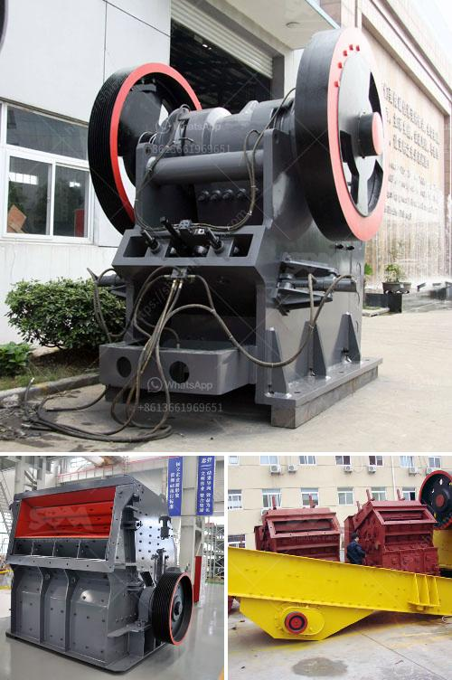

<h3>used quarry crusher for sale</h3>
Used quarry crushers are commonly used for crushing materials such as granite, limestone, sandstone and basalt. As the name suggests, these crushers are designed to break down larger pieces of rock into smaller stones. This process is often done in stages, with the first stage involving the initial crushing of the raw materials into manageable sizes.

One of the main advantages of buying a used quarry crusher is the significant cost savings. New crushers can be quite expensive, especially if you are looking for a large capacity machine. On the other hand, used crushers are generally much cheaper and can offer great value for money. This is especially true if you find a machine that has been well-maintained and is in good working condition.

Furthermore, used quarry crushers are readily available in the market, making it easier for buyers to find the right machine for their specific needs. With a wide range of models and brands to choose from, you can easily compare prices and specifications to ensure that you get the best deal. Additionally, buying a used crusher allows you to see how it performed in the past, giving you a better idea of its reliability and performance.

It's important, however, to consider a few factors when purchasing a used quarry crusher. First, check the overall condition of the machine, including the engine, hydraulics, and wear parts. It's also a good idea to inspect the crusher in person, if possible, to ensure that it meets your requirements. Additionally, consider the maintenance history and any repairs that have been done on the machine.

In conclusion, buying a used quarry crusher can be a cost-effective solution for those in the mining and quarrying industry. With the right research and due diligence, you can find a reliable machine that fits your needs and budget. Whether you are looking for a primary, secondary or tertiary crusher, there are plenty of used options available that can help you achieve your production goals.
<h3>Contact us</h3><ul><li><strong>Whatsapp:&nbsp;<a href="https://wa.me/8613661969651">+8613661969651</a></strong></li><li><a href="https://swt.shibang-china.com/?git&amp;zhl&amp;used quarry crusher for sale"><strong>Online Service(chat now)</strong></a></li></ul><h3>Related</h3><ul><li><a href='selling stone crusher plant.md'>selling stone crusher plant</a></li><li><a href='kaolin dry beneficiation.md'>kaolin dry beneficiation</a></li><li><a href='conveyor belt manufacturers in kolkata.md'>conveyor belt manufacturers in kolkata</a></li><li><a href='quarry crushing suppliers.md'>quarry crushing suppliers</a></li><li><a href='100tpd complete gold plant.md'>100tpd complete gold plant</a></li></ul>