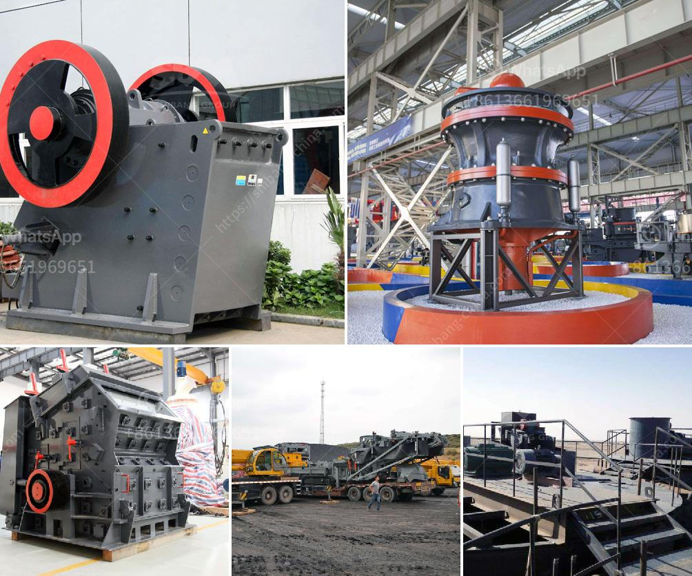

<h3>used quarry crusher in south africa</h3>
The quarry crusher, also known as stone crusher, is mainly used for crushing large rocks or ores into smaller sizes. It is an essential piece of equipment in many industries, including mining, construction, and demolition.

South Africa is rich in mineral resources, including gold, platinum group metals, manganese, vanadium, chromium, titanium, and coal, and many other minerals. It is the world's fifth-largest producer of gold and platinum group metals. With such abundant natural resources, the mining industry plays a significant role in South Africa's economy.

Used quarry crushers are widely utilized in South Africa mining industry for crushing, grinding, and beneficiation. The used quarry crusher machine has the advantage of high productivity, low energy consumption, easy maintenance and reliable operation. It is especially suitable for crushing various hard and abrasive materials such as granite, basalt, limestone, river stone, sandstone, and quartzite.

In South Africa, used quarry crushers are commonly used in the primary crushing stage for processing large-sized rocks and minerals. They are also utilized in the secondary and tertiary crushing stages to reduce the size of fine particles. The crushers function by applying compressive force to break down the material into smaller pieces, making it easier to handle and transport.

With the continuous development of infrastructure in South Africa, there is a growing demand for stone aggregate. Used quarry crushers are an essential tool for meeting this demand and enabling efficient production of construction materials. They are particularly valuable in road and building construction projects, as well as in the production of concrete and asphalt.

Overall, the use of used quarry crushers in South Africa not only helps to extract valuable minerals but also contributes to the economic growth of the country. By recycling and reusing materials, these crushers promote sustainability and reduce the environmental impact associated with mining operations.

In conclusion, used quarry crushers are crucial equipment in the mining industry in South Africa. They are efficient, reliable, and environmentally friendly, making them a valuable asset for any quarry or mining operation. Whether it is for primary, secondary, or tertiary crushing, these crushers play a vital role in meeting the growing demand for stone aggregate in South Africa's construction industry.
<h3>Contact us</h3><ul><li><strong>Whatsapp:&nbsp;<a href="https://wa.me/8613661969651">+8613661969651</a></strong></li><li><a href="https://swt.shibang-china.com/?git&amp;zhl&amp;used quarry crusher in south africa"><strong>Online Service(chat now)</strong></a></li></ul><h3>Related</h3><ul><li><a href='used coal washing plant sale.md'>used coal washing plant sale</a></li><li><a href='alluvial gold mining equipment used for sale.md'>alluvial gold mining equipment used for sale</a></li><li><a href='rock hammer mill for sale.md'>rock hammer mill for sale</a></li><li><a href='dry iron ore processing methods.md'>dry iron ore processing methods</a></li><li><a href='crusher plant in construction.md'>crusher plant in construction</a></li></ul>