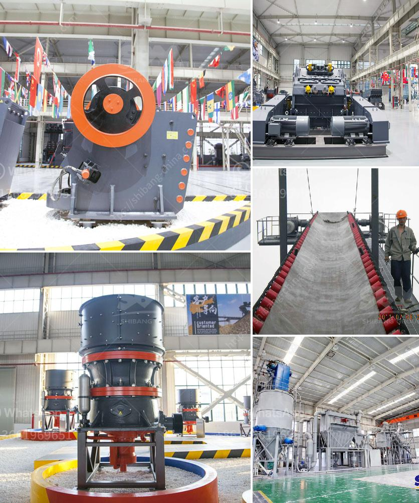

<h3>used raymond mill for sale</h3>
Raymond mill is a vertical grinding mill that offers efficient and low-cost powder production. The Raymond roller mill is mainly composed of main unit, analyzer, fan, dischargeing cyclone separator, powder cyclone separator and air duct. Among them, the main unit consists of grinding roller, grinding ring, scraper blade and casing. Raymond mill is used for grinding non-flammable and non-explosive materials whose Moh’s hardness is below 9.3 and humidity less than 6% such as barite, calcite, potassium feldspar, talc, marble, limestone, dolomite, fluorite and lime, activated clay, activated carbon, bentonite, kaolin, cement, phosphate rock, gypsum, glass and thermal insulation materials in mine, metallurgy, chemistry, building materials industry and other industries.

Whether you are building your dream home or planning a renovation, Raymond mills are essential grinding equipment. However, buying new Raymond mills can be expensive, particularly for those on a tight budget. As a result, many people have decided to shop for used Raymond mills and rely on them for their grinding needs.

There are several advantages to buying used Raymond mills. One major advantage is the cost savings. Used Raymond mills are significantly cheaper than new ones, making them a practical choice for many. Additionally, used mills are often readily available, so you can avoid the waiting time associated with ordering a new one.

When shopping for a used Raymond mill, there are a few things to keep in mind. First, you should have a clear understanding of your specific grinding needs and the capacity you require. This information will help you determine the size and type of mill that is best suited for your purposes. Additionally, inspect the mill carefully for any signs of wear and tear. Ask for maintenance records if they are available, and inquire about any recent repairs or replacements that have been made. This information can help you assess the overall condition and reliability of the mill.

It is also important to consider the reputation and credibility of the seller. Research the seller online and look for reviews or testimonials from previous customers. If possible, visit the seller in person to inspect the mill for yourself and ask any questions you may have. Reputable sellers will be transparent about the condition, history, and performance of the mill.

If you are unsure where to find used Raymond mills for sale, there are several avenues to explore. One option is to check online auction websites or classified advertisements. These platforms often have a wide range of used mills available for purchase. Alternatively, you can contact local machinery dealers or industrial equipment suppliers to inquire about used Raymond mills they may have in stock.

In conclusion, buying a used Raymond mill can be a cost-effective solution for those in need of grinding equipment. The cost savings and availability of used mills make them a practical choice for many. However, it is important to thoroughly inspect the mill and research the seller before making a purchase. By doing these steps, you can ensure that the used Raymond mill you choose is reliable and suited for your specific needs.
<h3>Contact us</h3><ul><li><strong>Whatsapp:&nbsp;<a href="https://wa.me/8613661969651">+8613661969651</a></strong></li><li><a href="https://swt.shibang-china.com/?git&amp;zhl&amp;used raymond mill for sale"><strong>Online Service(chat now)</strong></a></li></ul><h3>Related</h3><ul><li><a href='materials used in mining gold and diamond.md'>materials used in mining gold and diamond</a></li><li><a href='equipment for grinding calcium carbonate.md'>equipment for grinding calcium carbonate</a></li><li><a href='magnetic enrichment of manganese ore.md'>magnetic enrichment of manganese ore</a></li><li><a href='talcum powder philling machine.md'>talcum powder philling machine</a></li><li><a href='cost of cassava milling machine in ghana.md'>cost of cassava milling machine in ghana</a></li></ul>