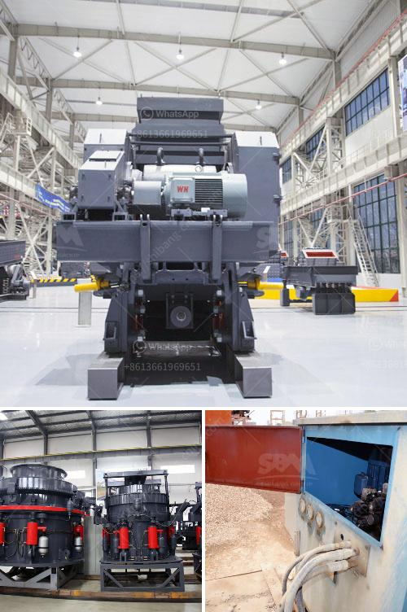

<h3>used rock crusher europe</h3>
Rock crushing has been an integral part of the construction industry for centuries. With the increasing demand for construction materials and the need for more efficient and cost-effective methods of rock extraction, the use of used rock crushers has gained popularity in Europe. These machines offer a cost-effective solution for various crushing applications and can be a valuable asset for any construction project.

One of the key advantages of using used rock crushers is their affordability. Buying new equipment can be expensive, especially for small and medium-sized construction companies. Used rock crushers provide a cost-effective alternative, allowing businesses to acquire the necessary equipment without stretching their budgets. Additionally, older models of rock crushers are often sold at a lower price, making them even more attractive for cost-conscious buyers.

Europe is home to a thriving market for used rock crushers. With a rich history of construction projects and a growing demand for rock materials, there is a constant supply of used crushers available. This allows buyers to choose from a wide range of models and brands, ensuring that they find the right crusher to meet their specific needs.

Furthermore, used rock crushers offer versatility and adaptability. Most models come with adjustable settings that allow operators to crush different types of rocks and materials. This versatility is crucial in construction applications, especially when dealing with varying rock densities and sizes. Whether it's crushing limestone, granite, or concrete, used rock crushers can handle the job efficiently.

In addition to cost-effectiveness, used rock crushers are known for their durability and reliability. Even though these machines have been previously used, reputable sellers make sure that they are in good working condition before being sold. This ensures that buyers can rely on their used crushers to withstand the rigors of daily operations. Moreover, many sellers offer warranties and after-sales services, providing peace of mind to buyers.

The environmental benefits of using used rock crushers should also be noted. By reusing existing equipment, the demand for new machinery is reduced, resulting in lower energy consumption and less waste. As environmental sustainability becomes a growing concern, opting for used rock crushers supports efforts to reduce the carbon footprint of the construction industry.

In conclusion, used rock crushers offer a cost-effective and environmentally friendly solution for crushing applications in Europe. Their affordability, versatility, and durability make them a valuable asset for construction companies of all sizes. Whether it's for a small-scale construction project or a large infrastructure development, the availability of used rock crushers ensures that businesses can find the right equipment at the right price. By investing in used crushers, companies can achieve their crushing goals while minimizing their impact on the environment.
<h3>Contact us</h3><ul><li><strong>Whatsapp:&nbsp;<a href="https://wa.me/8613661969651">+8613661969651</a></strong></li><li><a href="https://swt.shibang-china.com/?git&amp;zhl&amp;used rock crusher europe"><strong>Online Service(chat now)</strong></a></li></ul><h3>Related</h3><ul><li><a href='floatation equipment for mining for sale in south africa.md'>floatation equipment for mining for sale in south africa</a></li><li><a href='bresting and crushing concrete philippines.md'>bresting and crushing concrete philippines</a></li><li><a href='cost of barite crusher in nigeria.md'>cost of barite crusher in nigeria</a></li><li><a href='raymond mill for limestone supplier in india.md'>raymond mill for limestone supplier in india</a></li><li><a href='small portable concrete crusher.md'>small portable concrete crusher</a></li></ul>