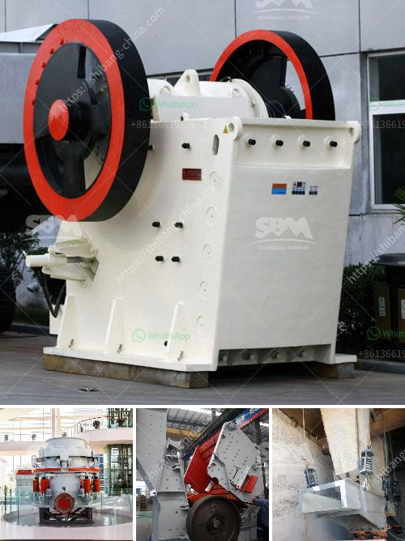

<h3>used rotary kiln equipment for sale</h3>
Used rotary kiln equipment can be a great investment for any industrial operation. Purchasing refurbished kilns provides businesses with a reliable and cost-effective solution to increase production capacity, reduce energy consumption, and decrease maintenance costs.

Rotary kilns are cylindrical furnaces used for a wide range of processing applications, such as calcination, thermal desorption, pyrolysis, and chemical reactions. They are commonly used in the cement, lime, and minerals processing industries, as well as in waste management and environmental remediation projects.

When considering the purchase of used rotary kiln equipment, there are several advantages to keep in mind. Firstly, buying used equipment can result in significant cost savings compared to purchasing brand new. The initial investment required for a new rotary kiln is substantial, while refurbished equipment offers a more budget-friendly option without compromising on quality or functionality.

Used rotary kilns also offer a faster installation process compared to new kilns. Since these machines have already been used, they can be delivered, installed, and put into operation much more quickly. This means that businesses can experience minimal downtime and begin utilizing the kiln’s capabilities without delay.

Furthermore, refurbished rotary kiln equipment provided by reputable suppliers often undergoes a rigorous inspection and refurbishment process. This ensures that any worn or damaged parts are repaired or replaced, guaranteeing the reliability and efficiency of the kiln. Additionally, suppliers may offer warranties on used equipment, providing peace of mind to customers and further ensuring its quality and performance.

One of the most significant advantages of purchasing used rotary kiln equipment is the positive environmental impact. By reusing and refurbishing existing kilns, businesses contribute to resource conservation and waste reduction efforts. This sustainable approach is aligned with the goals of many environmentally conscious organizations and can enhance the reputation and image of the company.

To ensure that the used rotary kiln equipment meets specific operational requirements, it is essential to work with reliable suppliers. Reputable suppliers have extensive knowledge and experience in the industry, allowing them to provide expert guidance and support throughout the purchasing process. They can assist in selecting the most suitable equipment for the application, provide detailed information on the kiln’s specifications and condition, as well as offer additional services such as installation, maintenance, and training.

In conclusion, used rotary kiln equipment for sale offers numerous benefits for businesses in various industries. By purchasing refurbished kilns, companies can save on costs, reduce downtime, and enhance their environmental sustainability efforts. However, it is crucial to partner with a trusted supplier to ensure the quality and performance of the equipment. With the right equipment and support, businesses can optimize their processes and achieve their production goals efficiently and effectively.
<h3>Contact us</h3><ul><li><strong>Whatsapp:&nbsp;<a href="https://wa.me/8613661969651">+8613661969651</a></strong></li><li><a href="https://swt.shibang-china.com/?git&amp;zhl&amp;used rotary kiln equipment for sale"><strong>Online Service(chat now)</strong></a></li></ul><h3>Related</h3><ul><li><a href='marble production line.md'>marble production line</a></li><li><a href='conveyor belt distributors in cebu.md'>conveyor belt distributors in cebu</a></li><li><a href='crawler mobile crushing plants.md'>crawler mobile crushing plants</a></li><li><a href='used rock crusher europe.md'>used rock crusher europe</a></li><li><a href='jaw crusher price list 150 x 200mm.md'>jaw crusher price list 150 x 200mm</a></li></ul>