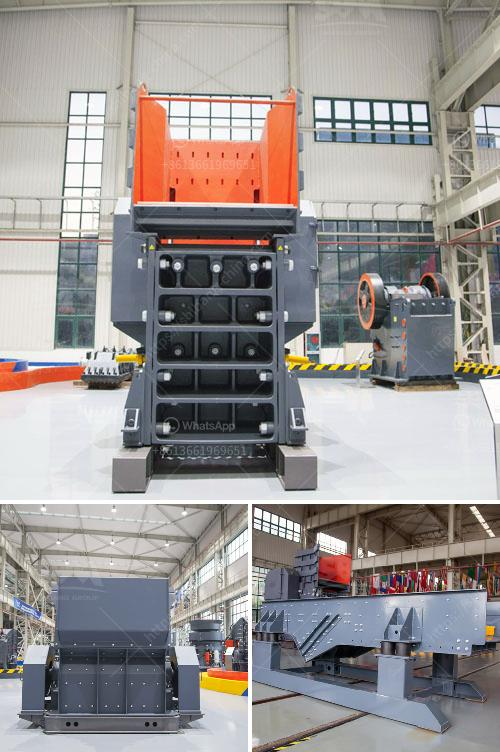

<h3>used stone crusher in pakistan</h3>
Used stone crusher in Pakistan is a complex process, which requires comprehensive mining machinery products understanding. The construction industry in Pakistan is experiencing a boom due to the increase in infrastructure development, such as the construction of roads, buildings, bridges, and dams. This surge in construction activities has led to the high demand for stone crushers, which are essential equipment for construction purposes.

Stone crushers are machines used to crush large stones into smaller pieces or gravel for construction purposes. These machines are typically found in quarries, where stone is mined and processed into smaller pieces for further use. The use of stone crushers has significantly increased the efficiency and productivity of construction projects in Pakistan. However, finding good-quality used stone crushers in Pakistan can be a challenging task.

There are several factors to consider when buying used stone crushers in Pakistan. First and foremost, it is crucial to ensure that the stone crusher is in good working condition. It is essential to inspect the machine carefully, checking for any damages or signs of wear and tear. This will help in determining whether the machinery requires any repairs or replacement parts.

Secondly, it is crucial to consider the production capacity of the stone crusher. The production capacity refers to the amount of material that the crusher can process within a specified time period. It is essential to choose a stone crusher with a higher production capacity to meet the demands of construction projects effectively.

Moreover, the type of stone crusher should also be considered. There are various types of stone crushers available in the market, including jaw crushers, impact crushers, cone crushers, and hammer crushers. Each type of crusher has its specific advantages and applications. Therefore, it is important to choose a stone crusher that is suitable for the construction project's requirements.

Additionally, the cost of the used stone crusher should be carefully evaluated. It is essential to compare the prices offered by different sellers to ensure that the purchase is cost-effective. However, it is equally important not to compromise on quality for the sake of a lower price. Investing in a high-quality used stone crusher will ensure its durability and long-lasting performance.

Lastly, it is advisable to seek professional advice when purchasing a used stone crusher in Pakistan. Consulting with experts in the field will help in making an informed decision that takes into account all the essential factors. These experts can provide guidance on the best brands, models, and specifications of stone crushers that are suitable for specific construction projects.

In conclusion, the use of stone crushers in Pakistan's construction industry is vital for efficient and productive infrastructure development. Buying a used stone crusher requires careful consideration of factors such as working condition, production capacity, type, cost, and seeking professional advice. By following these guidelines, individuals can make an informed decision and acquire a high-quality used stone crusher for their construction needs in Pakistan.
<h3>Contact us</h3><ul><li><strong>Whatsapp:&nbsp;<a href="https://wa.me/8613661969651">+8613661969651</a></strong></li><li><a href="https://swt.shibang-china.com/?git&amp;zhl&amp;used stone crusher in pakistan"><strong>Online Service(chat now)</strong></a></li></ul><h3>Related</h3><ul><li><a href='how to set up a stone quarry company.md'>how to set up a stone quarry company</a></li><li><a href='stone crusher machine for sale tanzania.md'>stone crusher machine for sale tanzania</a></li><li><a href='to see models of vibrating screens.md'>to see models of vibrating screens</a></li><li><a href='small scale industrial pulveriser.md'>small scale industrial pulveriser</a></li><li><a href='jaw crusher baxter.md'>jaw crusher baxter</a></li></ul>