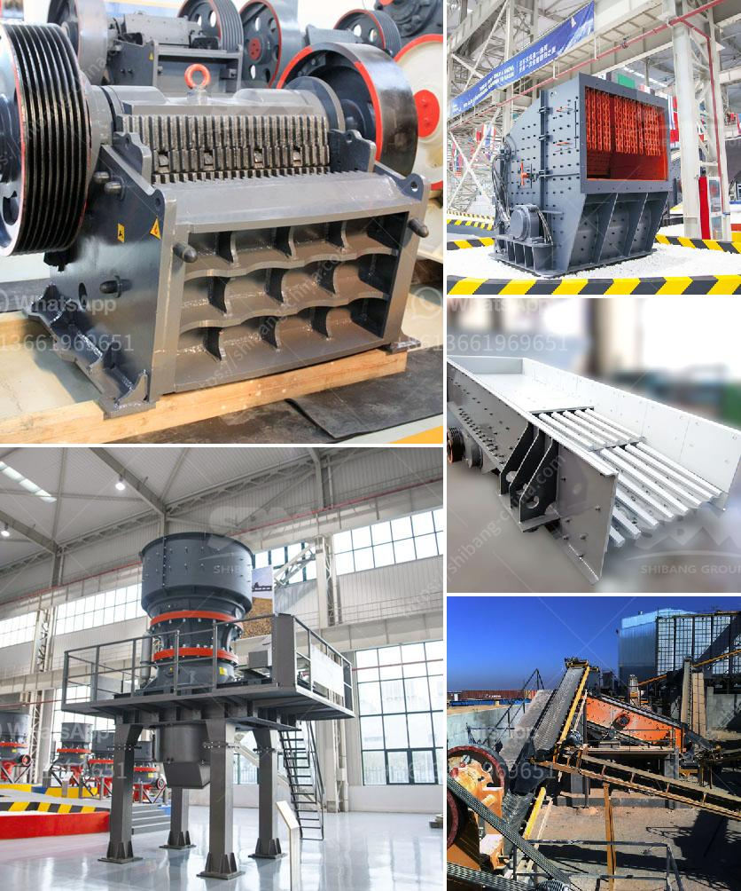

<h3>used stone crusher plant for sale andhra pradesh</h3>
It is no exaggeration to say that the intermediate cities and towns of Andhra Pradesh have undergone a transformative change in the past few years. Thanks to an ever-increasing focus on infrastructure development, the state has emerged as one of the most sought-after destinations for industrial growth in India. And with this growth, the demand for raw materials and construction materials has surged. One such material is stone, used extensively in the construction industry.

Andhra Pradesh is known for its rich geological reserves of various minerals like iron ore, limestone, coal, granite, manganese ore, bauxite, and much more. It has a strong foundation in the mining sector, making it an ideal state for the establishment of stone crushing plants. The stone crushing industry plays an important role in industrial and construction sectors. Clearly, it is contributing towards the growth of the economy.

The stone crusher plants manufactured by companies such as ABM Equipment and Constructions are built with high precision and have a long-lasting impact on the construction industry. These machines are considered highly efficient for breaking stones into the desired sizes. These stone crusher plants are available for sale without any limitation. Therefore, used stone crusher plants for sale in Andhra Pradesh have a great market potential among the mining investors.

In recent years, the Andhra Pradesh government has taken a proactive approach towards the development of infrastructure and construction sectors. Initiatives like the Amaravati Capital City Project, Polavaram Irrigation Project, and expansion of the Visakhapatnam Port have instilled confidence among industrialists and investors. As a result, there has been a surge in the demand for stone crusher plants in Andhra Pradesh.

The used stone crusher plant for sale in Andhra Pradesh is of superior quality. It has robust construction, high durability, and longer operation life. Moreover, the cost of stone crusher plant is also reasonable, making it an attractive proposition for businesses across industries. In addition, there is immense untapped potential in the state for exploration of precious minerals, which can further fuel the demand for stone crusher plants.

With its strategic location and favorable policies, Andhra Pradesh has become a hotbed for investment in the mining sector. The used stone crusher plant for sale in Andhra Pradesh offers investment opportunities for mining entrepreneurs and buyers without any restrictions. Whether you are a new entrant or experienced in the mining industry, this is a golden opportunity to invest and reap high returns. 

In conclusion, the used stone crusher plants available for sale in Andhra Pradesh are an excellent investment opportunity for mining entrepreneurs and investors. The state's rich geological reserves, proactive government policies, and growing demand in the construction industry make it a promising destination for the establishment of stone crushing plants. By capitalizing on this potential, businesses can contribute to the overall growth and development of Andhra Pradesh while enjoying handsome returns on their investments.
<h3>Contact us</h3><ul><li><strong>Whatsapp:&nbsp;<a href="https://wa.me/8613661969651">+8613661969651</a></strong></li><li><a href="https://swt.shibang-china.com/?git&amp;zhl&amp;used stone crusher plant for sale andhra pradesh"><strong>Online Service(chat now)</strong></a></li></ul><h3>Related</h3><ul><li><a href='second hand stone crusher sale in india.md'>second hand stone crusher sale in india</a></li><li><a href='coal mining equipment in spain.md'>coal mining equipment in spain</a></li><li><a href='pf series impact crusher.md'>pf series impact crusher</a></li><li><a href='zambia mobile crusher.md'>zambia mobile crusher</a></li><li><a href='stone crusher and quarry plant in galway ireland.md'>stone crusher and quarry plant in galway ireland</a></li></ul>