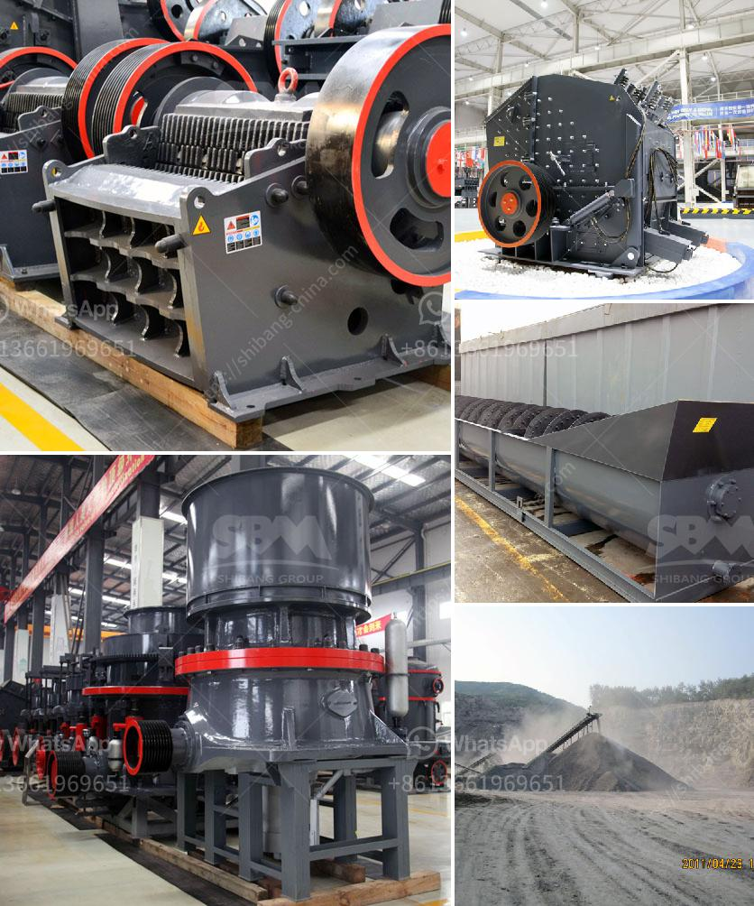

<h3>used stone crusher plant for sale in uk</h3>
The stone crusher plant is used for producing sand, rock and stone for construction, highway, railway and other applications. Fote Heavy Machinery, with 40 years of experience in the stone crushing production line, is skilled in the production line process design and has a high-cost performance.

The stone crusher plant is generally composed of the feeder, crusher, vibrating screen, belt conveyor and other equipment. The feeder, vibrating screen and belt conveyor are all configuration equipment. The main equipment of a stone crusher plant is the crusher. The crushed stone production line is generally divided into coarse (primary), secondary and tertiary crushing.

The equipment required for the crushing operation of the stone crusher plant is different from the machinery for a sand and stone production line. Different stone crusher machines manufacturing companies provide a variety of crushing devices for sale, such as jaw crushers, impact crushers, cone crushers, hammer crushers, and so on. These manufacturers can be broadly divided into the following categories:

Each brand has its own unique advantages and disadvantages. For example, foreign brands tend to have better reliability and performance, but they are more expensive. In contrast, domestic brands are relatively less expensive and have excellent after-sales service.

When purchasing a stone crusher plant, you should have a clear understanding of the features of the various models and compare them to choose the right equipment according to your specific needs. Here are a few points to consider:

1. Output: The output capacity of the plant should be matched with the expected processing capacity of the stone crusher. Different models have different output capacities, ranging from a few tons to hundreds of tons per hour.

2. Size of raw materials: The size of the raw materials determines the size of the equipment required. Generally, if the raw materials are large, a jaw crusher is recommended; if the materials are small, a hammer crusher or impact crusher may be more suitable.

3. Crushing efficiency: The crushing efficiency of different types of crushers is different. The higher the crushing efficiency, the higher the yield and the higher the quality of the finished product.

4. Energy consumption: The energy consumption of the crusher is one of the important indicators of its cost-effectiveness. Low energy consumption means lower operating costs.

In conclusion, when purchasing a stone crusher plant, it is essential to consider the various options available and compare them to make an informed decision. Both domestic and foreign brands have their own advantages and disadvantages, so choose the one that best suits your needs. Remember to consider factors such as output, size of raw materials, crushing efficiency, and energy consumption to ensure the plant's cost-effectiveness. With the right stone crusher plant, you can achieve efficient and high-quality stone production.
<h3>Contact us</h3><ul><li><strong>Whatsapp:&nbsp;<a href="https://wa.me/8613661969651">+8613661969651</a></strong></li><li><a href="https://swt.shibang-china.com/?git&amp;zhl&amp;used stone crusher plant for sale in uk"><strong>Online Service(chat now)</strong></a></li></ul><h3>Related</h3><ul><li><a href='mica crushing processing in nigeria.md'>mica crushing processing in nigeria</a></li><li><a href='lime processing plant.md'>lime processing plant</a></li><li><a href='aggregates crusher philippines.md'>aggregates crusher philippines</a></li><li><a href='ball mill zenit crusher china.md'>ball mill zenit crusher china</a></li><li><a href='100tph gold ore processing plant.md'>100tph gold ore processing plant</a></li></ul>