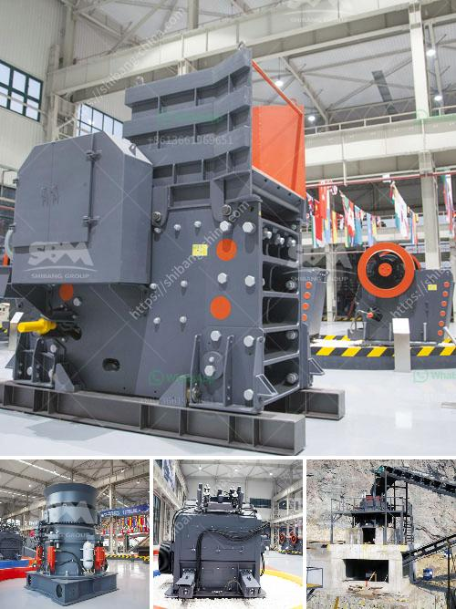

<h3>used sweco screening equipment for sale</h3>
In the world of industrial processing, screening plays a vital role in ensuring the quality and efficiency of products. Whether it's separating solids from liquids, classifying materials based on size, or efficiently dewatering slurry materials, having the right screening equipment can make all the difference. This is where Sweco, a renowned manufacturer of screening equipment, enters the picture. And if you are looking for cost-effective screening solutions, buying used Sweco screening equipment for sale can be a smart choice.

Sweco has been a recognized name in the industry for over 70 years, known for their cutting-edge technology, high-quality products, and innovative designs. Their screening equipment is widely used in a range of industries, including mining, pharmaceuticals, chemicals, food processing, and more. However, like any other high-quality equipment, Sweco screening machines can come with a hefty price tag when bought brand new. This is where the used equipment market presents an opportunity to acquire these top-of-the-range machines at a fraction of the original cost.

One might wonder, why should I consider buying used screening equipment? The answer lies in the many advantages it offers. Firstly, cost savings are the most obvious benefit. Used Sweco screening equipment is significantly more affordable compared to its brand-new counterpart, allowing you to stretch your budget further. This can be especially beneficial for small to medium-sized enterprises or for those looking to expand their manufacturing capabilities without breaking the bank.

Not only do you save on the upfront cost, but buying used also eliminates the depreciation that occurs with new equipment. As a result, the resale value of used Sweco screening equipment remains relatively stable, ensuring that your investment is protected in the long run. Additionally, the strong reputation of Sweco translates into reliable and durable screening equipment. A used Sweco machine that has been properly maintained by the previous owner can provide years of dependable service, performing at the same level as a new machine.

Finding used Sweco screening equipment for sale is easier than ever, thanks to online marketplaces, specialized equipment dealers, and auctions. These platforms offer a wide range of options, allowing you to choose the specific model that matches your screening requirements. However, it is essential to conduct thorough research and source from reputable sellers to ensure you are getting a machine in good condition.

Before purchasing any used equipment, it is advisable to inspect the machine, review its maintenance history, and, if possible, request a demonstration. This will help determine if the machine meets your specific needs and is in proper working order. It is also worth considering third-party inspections or warranties offered by the seller to provide further assurance.

In conclusion, investing in used Sweco screening equipment for sale is a cost-effective solution for businesses seeking reliable and high-quality screening capabilities. By taking advantage of the unique advantages presented by the used equipment market, companies can save money, protect their investments, and acquire state-of-the-art machines from an industry leader like Sweco. So, whether you are looking to replace an existing machine or expand your screening operations, exploring the used equipment market for Sweco screening equipment can be a wise decision.
<h3>Contact us</h3><ul><li><strong>Whatsapp:&nbsp;<a href="https://wa.me/8613661969651">+8613661969651</a></strong></li><li><a href="https://swt.shibang-china.com/?git&amp;zhl&amp;used sweco screening equipment for sale"><strong>Online Service(chat now)</strong></a></li></ul><h3>Related</h3><ul><li><a href='stone crusher design.md'>stone crusher design</a></li><li><a href='jaw crusher 30 x 12.md'>jaw crusher 30 x 12</a></li><li><a href='450 tph limestone crusher.md'>450 tph limestone crusher</a></li><li><a href='manufacturer of ultrafine machine india.md'>manufacturer of ultrafine machine india</a></li><li><a href='crusher plant price.md'>crusher plant price</a></li></ul>