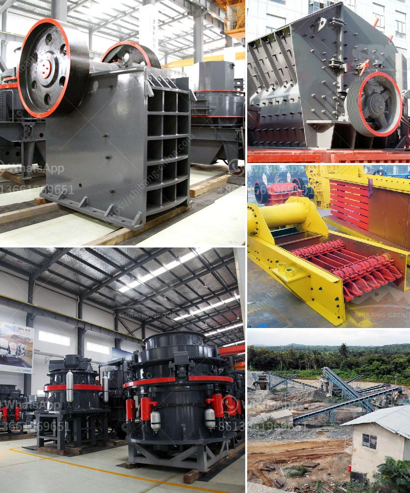

<h3>vail crushing meachine models in pharma</h3>
In the pharmaceutical industry, the disposal of empty vials is a task that continuously demands attention. As pharmaceutical companies strive to enhance operational efficiency and ensure a safe working environment, vial crushing machines have emerged as a valuable solution. These machines not only simplify disposal but also contribute to environmental sustainability. This article will explore the various vial crushing machine models available in the pharmaceutical market and their significance in enhancing both efficiency and safety.

One of the leading vial crushing machine models in the pharma industry is the automatic vial crusher machine. This model efficiently processes a large number of vials per hour, reducing the manual effort required for vial disposal. Equipped with sharp blades and automatic feeding mechanisms, these machines can crush vials of different sizes within seconds, significantly reducing the time employees spend on this task.

Another popular model is the pneumatic vial crushing machine. This machine utilizes air pressure to crush vials, making it less physically demanding for operators. With user-friendly controls and adjustable settings, the pneumatic model ensures optimal crushing for various types of vials. Additionally, its compact size allows it to fit seamlessly into the existing workspace, minimizing any disruption to daily operations.

Furthermore, some vial crushing machine models are equipped with additional safety features. For instance, the "anti-jamming" mechanism prevents blockages caused by vials getting stuck in the crushing chamber. This feature not only ensures uninterrupted operation but also reduces the risk of accidents or injuries that may occur while trying to manually clear any blockages. Moreover, advanced sensor-based technology is employed in certain models to automatically detect and separate metallic or non-crushable items, safeguarding both the machine and vial integrity.

The adoption of vial crushing machines in pharma companies offers numerous benefits. Firstly, it streamlines the vial disposal process, enabling employees to focus on other critical tasks. By automating the crushing process, these machines improve productivity and efficiency within the pharmaceutical setting, contributing to overall cost savings.

Secondly, vial crushing machines significantly reduce the risk of accidental injuries or health hazards associated with vial disposal. Employees no longer need to manually handle and crush large volumes of vials, which could potentially lead to cuts, punctures, or exposure to harmful substances. The mechanized process ensures a safer working environment, protecting the health and well-being of pharmaceutical personnel.

Lastly, vial crushing machines are environmentally-friendly solutions, promoting sustainable waste management practices within the pharmaceutical industry. By compacting the vials, these machines reduce the overall volume of waste generated. This allows for more efficient transportation and disposal while minimizing the environmental impact associated with vial waste, such as landfill usage or incineration.

In conclusion, vial crushing machines have become an indispensable tool for pharmaceutical companies seeking to enhance operational efficiency and ensure a safe working environment. With their automatic functioning, additional safety features, and environmental benefits, these machines significantly simplify the vial disposal process. By adopting these innovative technologies, pharma companies not only save time and resources but also contribute to the larger goal of sustainable waste management.
<h3>Contact us</h3><ul><li><strong>Whatsapp:&nbsp;<a href="https://wa.me/8613661969651">+8613661969651</a></strong></li><li><a href="https://swt.shibang-china.com/?git&amp;zhl&amp;vail crushing meachine models in pharma"><strong>Online Service(chat now)</strong></a></li></ul><h3>Related</h3><ul><li><a href='second hand stone crusher sale in india.md'>second hand stone crusher sale in india</a></li><li><a href='cone crusher for sale in ghana.md'>cone crusher for sale in ghana</a></li><li><a href='100tpd cement plant in india.md'>100tpd cement plant in india</a></li><li><a href='talcum powder philling machine.md'>talcum powder philling machine</a></li><li><a href='crusher jaw crusher.md'>crusher jaw crusher</a></li></ul>