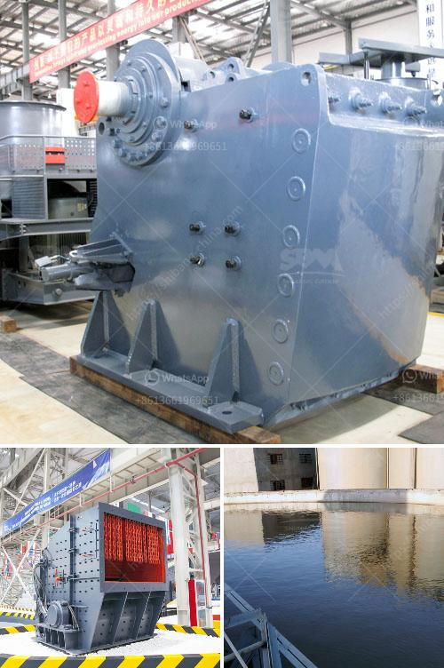

<h3>vertical coal mill single diagram</h3>
Vertical coal mill is typically designed to process materials in medium hardness, like soft coal or bituminous coal, and it is mainly used in positive pressure pulverizing system of soft coal. It is widely used in thermal power plant, metallurgy sector, building material industry, chemical industry, etc.

The coal pulverizing system in the vertical mill mainly consists of the grinding and classifying section. The main components include grinding roller, grinding disc, pressure device, classifier housing, and other supporting parts.

The grinding roller is an important component of the vertical mill. It is a kind of wearing parts during the operation of the coal mill. The material is ground by the grinding roller on the grinding disc. When the material passes, it is crushed by the grinding roller and the grinding disc. The grinding roller is equipped with a sheath ring. It increases the contact area between the grinding roller and the grinding disc, improving the grinding efficiency.

The grinding disc is fixed on the output shaft of the reducer. It consists of a grinding disc body and a blade. The blade is fixed on the grinding disc body. When the grinding disc rotates, the blade lifts the material and then throws it to the lining plate of the grinding disc. The material is ground between the grinding roller and the grinding disc.

The pressure device provides grinding pressure for the grinding roller, ensuring the stable and efficient operation of the coal mill. The pressure device is located below the grinding disc. It consists of an oil cylinder, a piston rod, a spring, etc. By adjusting the pressure of the spring, the grinding pressure can be adjusted to meet the needs of different materials.

The classifier housing is fixed on the top of the vertical mill. It is mainly composed of an upper shell, a lower shell, and a rotor. The classifier rotor rotates at high speed, and the coal particles are classified by centrifugal force. The qualified coal powder is collected by the lower shell and sent to the combustion system for combustion. The oversized coal particles are returned to the grinding disc for re-grinding.

In summary, the single diagram of the vertical coal mill reflects the mechanical components and their functions in the coal pulverizing system. Each component plays an important role in the pulverizing process, ensuring the stable and efficient operation of the coal mill. With its reliable performance and wide application, the vertical coal mill has become a popular choice in various industries for coal grinding.
<h3>Contact us</h3><ul><li><strong>Whatsapp:&nbsp;<a href="https://wa.me/8613661969651">+8613661969651</a></strong></li><li><a href="https://swt.shibang-china.com/?git&amp;zhl&amp;vertical coal mill single diagram"><strong>Online Service(chat now)</strong></a></li></ul><h3>Related</h3><ul><li><a href='hard rock ultrafine grinder in canada.md'>hard rock ultrafine grinder in canada</a></li><li><a href='crusher machine from south philippines.md'>crusher machine from south philippines</a></li><li><a href='prices of copper smelting plant.md'>prices of copper smelting plant</a></li><li><a href='diagram of vertical hammer mill.md'>diagram of vertical hammer mill</a></li><li><a href='clay kaolin processing equipment.md'>clay kaolin processing equipment</a></li></ul>