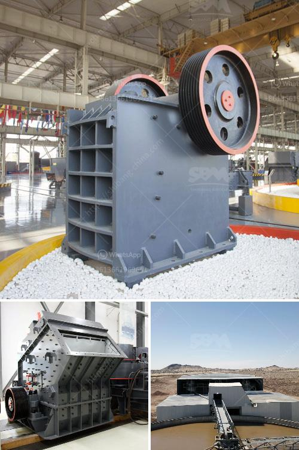

<h3>vertical coal mill</h3>
The vertical coal mill is a widely used equipment in the cement, electric power, metallurgy, chemical, and non-metallic minerals industries. It is efficient and energy-saving, and has advantages of strong adaptability to materials, continuous production, large crushing ratio, and easy fineness adjustment of the pulverized coal.

The mill's grinding disc is driving by a motor, reducer, and the material falls from the feed inlet to the center of the grinding disc. Under the action of centrifugal force, the material moves from the center to the edge of the grinding disc, and is crushed by the grinding roller. The pulverized coal is brought up by the air ring at the edge of the grinding disc, and the coarse particles are returned to the grinding disc for regrinding. The fine coal powder is collected by the dust collector, and the purified gas is discharged by the fan.

The vertical coal mill produces pulverized coal particles of smaller sizes, which allows for better combustion efficiency and better utilization of thermal energy. It is widely used in coal-fired power plants, steel plants, cement plants, and other industries that require pulverized coal fuel to achieve high-quality combustion.

In addition to coal, the vertical coal mill can also grind various ores and other materials with a moisture content of less than 10%, making it suitable for grinding non-flammable and explosive materials. Compared with ball mills and other grinding equipment, it can obtain higher yields and finer particles.

The vertical coal mill is easy to achieve automatic control, which greatly improves the grinding efficiency, reduces unnecessary waste of resources, and improves the utilization rate of coal resources. In the cement industry, vertical coal mill is used to grind pulverized coal into fine powder and provide the combustion heat required for the calcination of clinker.

In conclusion, the benefits of using a vertical coal mill in cement industry are numerous, as it offers advantages such as high efficiency, energy-saving, and ease of maintenance. Furthermore, it can handle a wide range of materials, ensuring high-quality combustion of pulverized coal fuel. With ongoing technological advancements, the vertical coal mill is becoming an increasingly popular choice for industries that require efficient and reliable grinding equipment.
<h3>Contact us</h3><ul><li><strong>Whatsapp:&nbsp;<a href="https://wa.me/8613661969651">+8613661969651</a></strong></li><li><a href="https://swt.shibang-china.com/?git&amp;zhl&amp;vertical coal mill"><strong>Online Service(chat now)</strong></a></li></ul><h3>Related</h3><ul><li><a href='jaw crusher size specifications.md'>jaw crusher size specifications</a></li><li><a href='5 ton per hour mobile gold process mill.md'>5 ton per hour mobile gold process mill</a></li><li><a href='tonnes per year cement plant machinary.md'>tonnes per year cement plant machinary</a></li><li><a href='cost of barite crusher in nigeria.md'>cost of barite crusher in nigeria</a></li><li><a href='aggregate vibrating screens.md'>aggregate vibrating screens</a></li></ul>