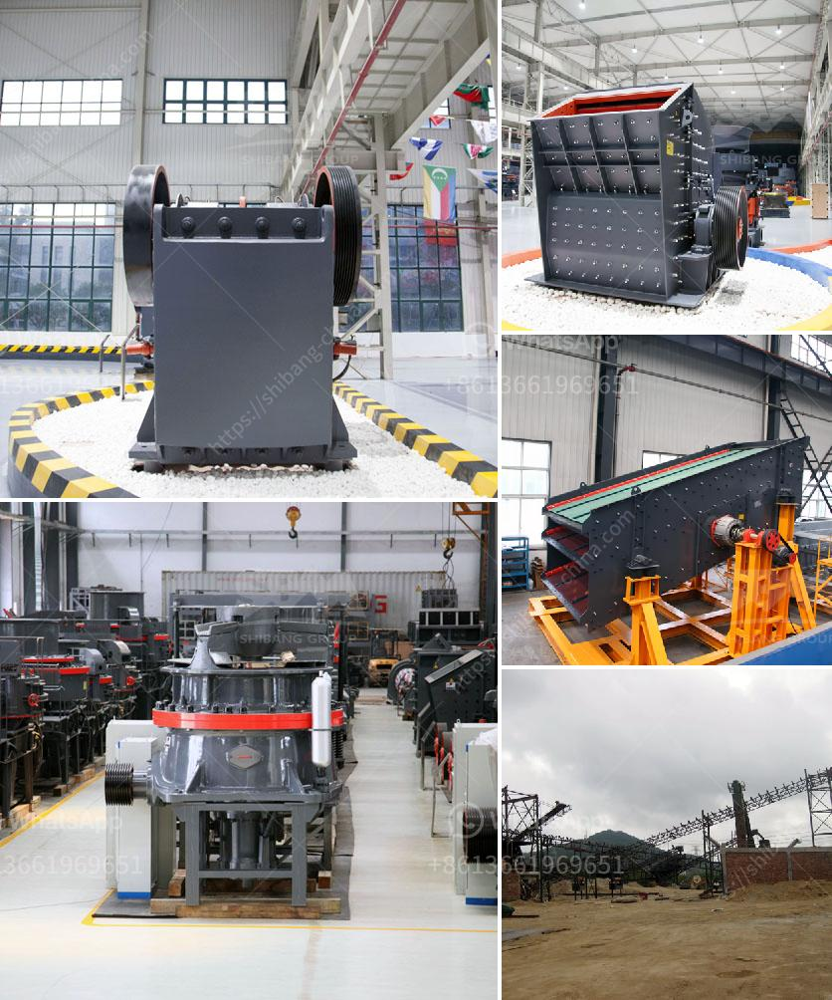

<h3>vertical grinding machine black and dacker</h3>
When it comes to precision grinding, there is no substitute for a reliable and high-performance machine. One such machine that fits the bill perfectly is the vertical grinding machine by Black and Decker. With a reputation for excellence, Black and Decker have consistently delivered innovative and powerful tools for professionals and enthusiasts alike.

The vertical grinding machine stands out for its unique design, providing superior precision and efficiency. Equipped with a robust motor, it can effortlessly handle a wide range of grinding tasks, from smoothing rough surfaces to sharpening blades. Whether you are working with metals, plastics, or even wood, this machine guarantees outstanding results every time.

One standout feature of the Black and Decker vertical grinding machine is its versatility. It comes with a range of adjustable speed settings, allowing you to customize the grinding process for your specific needs. This versatility not only enhances productivity but also ensures optimal results, regardless of the material or application.

In addition to its performance, the Black and Decker vertical grinding machine boasts a user-friendly interface. The intuitive controls make it easy to operate, even for those new to precision grinding. With minimal effort, you can navigate through the different speed settings, ensuring your work is completed efficiently and effectively.

As with any Black and Decker product, durability is a priority. The vertical grinding machine is constructed using high-quality materials, ensuring longevity and reliability. This means that you can rely on it for years to come, eliminating the need for frequent repairs or replacements.

Maintaining the vertical grinding machine is also hassle-free. It requires minimal upkeep, thanks to its simple yet sturdy construction. Routine cleaning and occasional lubrication will keep the machine in prime condition, ready to tackle any grinding task that comes its way.

In conclusion, the Black and Decker vertical grinding machine is the ultimate tool for precision grinding. Combining superior performance, durability, and user-friendliness, this machine is a valuable addition to any workshop. Whether you are a professional or a DIY enthusiast, investing in this powerful machine will elevate your grinding experience to new heights.
<h3>Contact us</h3><ul><li><strong>Whatsapp:&nbsp;<a href="https://wa.me/8613661969651">+8613661969651</a></strong></li><li><a href="https://swt.shibang-china.com/?git&amp;zhl&amp;vertical grinding machine black and dacker"><strong>Online Service(chat now)</strong></a></li></ul><h3>Related</h3><ul><li><a href='calcium carbonate processing plant price.md'>calcium carbonate processing plant price</a></li><li><a href='ansporting coal conveyor belt.md'>ansporting coal conveyor belt</a></li><li><a href='grinder rock crusher.md'>grinder rock crusher</a></li><li><a href='barytes pulverizer mill for sale india.md'>barytes pulverizer mill for sale india</a></li><li><a href='margalla stone crusher in islamabad.md'>margalla stone crusher in islamabad</a></li></ul>