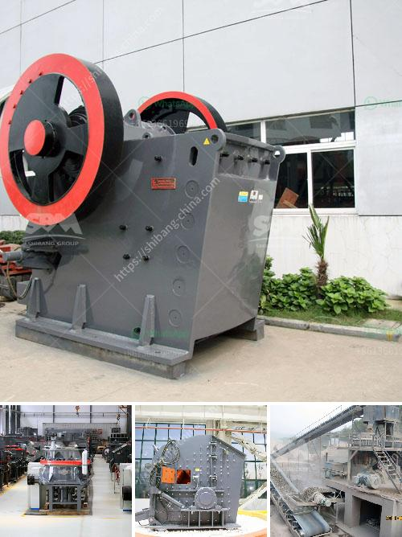

<h3>vertical grinding mill machine in china</h3>
Vertical grinding mill machine, also known as vertical roller mill, is a widely used grinding equipment in cement, electric power, metallurgy, chemical industry, non-metallic mineral, and other industries. It is mainly used for grinding raw materials, clinker, ground granulated blast furnace slag, iron ore, limestone, coal powder, coke powder, coal gangue, fly ash, volcanic ash, gypsum, calcite, pyrophyllite, sepiolite, diatomaceous earth, clay, graphite, petroleum coke, etc.

China is a major country in the production and consumption of vertical grinding mill machines. With the continuous development of the industrial sector and the advancement of technology, the vertical grinding mill machine produced by Chinese manufacturers has become more and more advanced in terms of functions, specifications, models, and production capacity.

1. High grinding efficiency: The grinding roller is used to crush and grind the materials on the grinding disc directly. The energy consumption is low and the grinding efficiency is high. Compared with ball mills and Raymond mills, the vertical grinding mill can save 30% to 40% energy consumption.

2. Wide application range: The vertical grinding mill machine can be used for grinding various materials with Mohs hardness below 9.3 and humidity below 6%, such as cement clinker, non-metallic mineral powder, slag, manganese ore, gypsum, coal, barite, calcite, and others. It has good adaptability to materials.

3. Stable operation: The grinding roller and grinding disc are designed with a unique curved liner. The grinding area is large and the contact area between the roller and the grinding disc is sufficient. This ensures that the materials are evenly distributed on the grinding disc during the grinding process, avoiding the phenomenon of uneven feeding and unstable operation.

4. Easy maintenance and low cost: The vertical grinding mill machine has a simple structure, small footprint, and easy installation. The wearing parts are made of high-quality wear-resistant materials, which can be easily replaced and have a long service life. The maintenance and operation costs are low, which effectively reduces the production cost of enterprises.

5. Environmental protection: The vertical grinding mill machine is equipped with a pulse dust collector and muffler, which can effectively reduce dust and noise pollution during the grinding process, creating a clean and environmentally friendly working environment.

In recent years, with the rapid development of China's economy and the continuous advancement of infrastructure construction, the demand for cement and other building materials has been increasing. As an important equipment for grinding raw materials in the cement industry, the vertical grinding mill machine plays a crucial role in ensuring the quality and output of cement production. It has become an ideal choice for many cement manufacturers.

In conclusion, the vertical grinding mill machine produced by Chinese manufacturers has the advantages of high grinding efficiency, wide application range, stable operation, easy maintenance, low cost, and environmental protection. It has been widely used in various industries and has made significant contributions to China's industrial development and economic growth. With the continuous improvement and innovation of technology, the Chinese vertical grinding mill machine will continue to make breakthroughs in performance and continue to serve the needs of various industries.
<h3>Contact us</h3><ul><li><strong>Whatsapp:&nbsp;<a href="https://wa.me/8613661969651">+8613661969651</a></strong></li><li><a href="https://swt.shibang-china.com/?git&amp;zhl&amp;vertical grinding mill machine in china"><strong>Online Service(chat now)</strong></a></li></ul><h3>Related</h3><ul><li><a href='manufacturer of conveyor belts.md'>manufacturer of conveyor belts</a></li><li><a href='italia crusher machine.md'>italia crusher machine</a></li><li><a href='pakistan coal crushing plant in peshawar.md'>pakistan coal crushing plant in peshawar</a></li><li><a href='calcium carbonate ball milling.md'>calcium carbonate ball milling</a></li><li><a href='small concrete crusher for sale.md'>small concrete crusher for sale</a></li></ul>