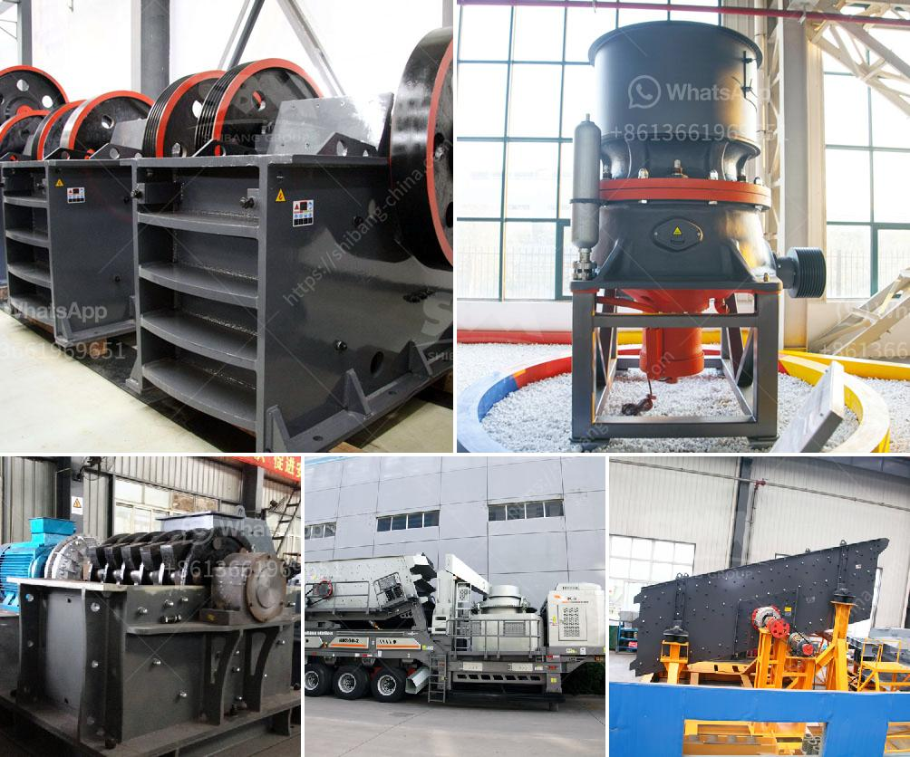

<h3>vibrating crushing plant</h3>
A vibrating crushing plant is a machine used to reduce large rocks into smaller rocks, gravel, or rock dust. This innovative plant incorporates a vibrating screen, a jaw crusher, and a cone crusher, all of which are integrated into a single machine. Traditionally, these machines are utilized in the mining and quarrying industries, where large rocks or ores need to be broken down into smaller pieces for further processing. In this article, we will explore the advantages of using a vibrating crushing plant.

Firstly, the vibrating crushing plant provides efficient and high-quality screening capabilities. The vibrating screen on the plant sieves the material to the desired size before it is sent to the crushers, ensuring that only the correct sized material is processed. This eliminates the need for a separate screening machine and reduces the overall footprint of the plant. Additionally, the vibrating screen has adjustable settings, allowing operators to control the size of the final product. This flexibility is especially important for different applications and specific customer requirements.

Secondly, the vibrating crushing plant is highly portable and can be easily transported from one site to another. This is particularly beneficial for companies involved in multiple projects or those that have temporary locations. The mobility of the plant enables it to be quickly set up and dismantled, reducing downtime and increasing productivity. Furthermore, the plant can be transported on a trailer or other suitable vehicle, making it convenient for transportation over long distances.

Thirdly, the vibrating crushing plant increases productivity and efficiency. By incorporating a vibrating screen, the plant removes any oversize material, which would otherwise clog the crushers and reduce their efficiency. This ensures a consistent and uninterrupted flow of material to the crushers, leading to higher production rates. The vibrating screen also minimizes the possibility of unnecessary equipment downtime due to blockages or irregular material feed.

Lastly, the vibrating crushing plant improves the working conditions for operators. The integrated design of the plant reduces the noise and dust emissions, creating a safer and healthier working environment. The crushers are equipped with dust suppression systems to minimize the release of harmful particles into the air, which is crucial for complying with environmental regulations. Additionally, the plant's automation features and user-friendly interface simplify operation, leading to fewer errors and less fatigue among the operators.

In conclusion, the vibrating crushing plant offers several advantages that make it a valuable addition to the mining and quarrying industries. Its efficient screening capabilities, portability, increased productivity, and improved working conditions make it an ideal choice for companies seeking to optimize their operations. As technology continues to advance, vibrating crushing plants will likely play an even more significant role in the industry, providing enhanced performance and increased profitability for businesses around the world.
<h3>Contact us</h3><ul><li><strong>Whatsapp:&nbsp;<a href="https://wa.me/8613661969651">+8613661969651</a></strong></li><li><a href="https://swt.shibang-china.com/?git&amp;zhl&amp;vibrating crushing plant"><strong>Online Service(chat now)</strong></a></li></ul><h3>Related</h3><ul><li><a href='new mobile and fixed rock crushing plant.md'>new mobile and fixed rock crushing plant</a></li><li><a href='vertical roller mill industrial.md'>vertical roller mill industrial</a></li><li><a href='difference between pebble and rock.md'>difference between pebble and rock</a></li><li><a href='stone crusher plate specifiion pdf sat.md'>stone crusher plate specifiion pdf sat</a></li><li><a href='gold processing equipment.md'>gold processing equipment</a></li></ul>