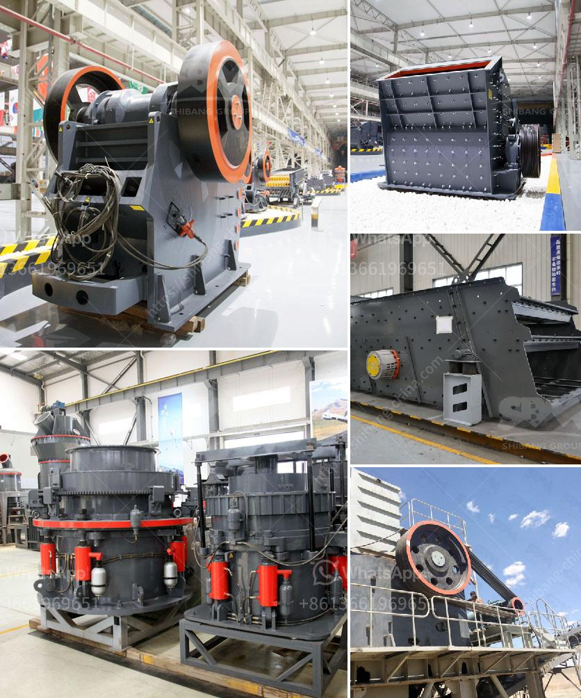

<h3>vibrating feeder sinter oret</h3>
The mining industry heavily relies on the use of vibrating feeders to transport various types of ores in bulk. One such application is sinter ore, a raw material used in the production of steel. Vibrating feeders are integral to sinter ore processing, as they provide a continuous flow of material, ensuring a smooth and efficient production process.

A vibrating feeder is a versatile equipment that can handle different types of materials of varying sizes. It consists of a vibrating conveyor that moves materials in a controlled manner, directing them to a processing machine or another equipment. In the case of sinter ore, the vibrating feeder transports the raw material from a storage bin to the sintering machine.

One of the key advantages of a vibrating feeder for sinter ore is its ability to handle large quantities of material. Sinter ore is typically produced in large quantities, and it is essential to have a feeder that can transport this material efficiently. The vibrating feeder can handle high-capacity loads, ensuring a continuous supply of sinter ore to the processing machine, thereby increasing productivity.

Additionally, vibrating feeders offer precise control over the flow of material. Sinter ore needs to be evenly distributed across the sintering machine for efficient processing. Uneven distribution can lead to inconsistent sintering and affect the quality of the final product. A vibrating feeder ensures an even and controlled distribution of the sinter ore, hence maintaining a consistent quality and reducing wastage.

Furthermore, vibrating feeders are known for their low maintenance requirements. The feeder is designed to withstand heavy use and harsh working conditions, such as the high temperatures and abrasive nature of sinter ore. This durability reduces downtime for maintenance, allowing for continuous operation and maximizing productivity.

In recent years, technological advancements have further improved the efficiency and performance of vibrating feeders. Many modern feeders incorporate features like adjustable speed and amplitude control, enabling operators to fine-tune the feeding process as per their requirements. This level of customization enhances the overall efficiency of the sinter ore processing plant.

Vibrating feeders also contribute to a safer working environment. The automated feeding system reduces the need for manual handling of the sinter ore, minimizing the risk of worker injuries. Additionally, the controlled flow of materials ensures a smooth and seamless operation, reducing the likelihood of equipment malfunctions or accidents.

In conclusion, vibrating feeders play a vital role in the efficient processing of sinter ore in the mining industry. Their ability to handle large quantities of material, provide precise control over the flow, and require low maintenance make them an indispensable tool for sinter ore processing plants. With ongoing technological advancements, vibrating feeders continue to enhance productivity and improve safety in the mining industry.
<h3>Contact us</h3><ul><li><strong>Whatsapp:&nbsp;<a href="https://wa.me/8613661969651">+8613661969651</a></strong></li><li><a href="https://swt.shibang-china.com/?git&amp;zhl&amp;vibrating feeder sinter oret"><strong>Online Service(chat now)</strong></a></li></ul><h3>Related</h3><ul><li><a href='barite mill in india.md'>barite mill in india</a></li><li><a href='coal processing machine.md'>coal processing machine</a></li><li><a href='italy rotary cement packing machine.md'>italy rotary cement packing machine</a></li><li><a href='marble and granite grinder and crusher.md'>marble and granite grinder and crusher</a></li><li><a href='philippine crushing machine.md'>philippine crushing machine</a></li></ul>