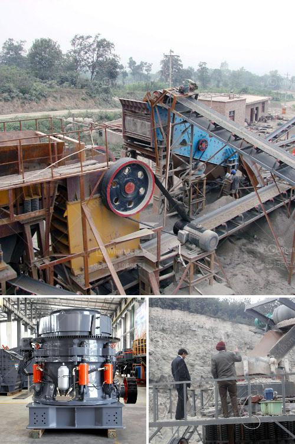

<h3>vibrating feeder zenith</h3>
The vibrating feeder zenith is an innovative and efficient piece of equipment that revolutionizes the process of material handling in various industries. With its advanced technology and superior performance, this equipment has become a crucial component in many production processes.

One of the key features of the vibrating feeder zenith is its ability to handle a wide range of materials. It can efficiently feed various bulk materials, including ore, coal, sand, and gravel. This versatility makes it a valuable tool in industries such as mining, construction, and metallurgy.

One of the main benefits of using the vibrating feeder zenith is its ability to control the flow rate of material. This ensures a consistent and uniform feed, preventing blockages and maximizing the efficiency of downstream processes. The adjustable amplitude and frequency settings allow operators to fine-tune the feeding process to meet specific requirements.

Another advantage of the vibrating feeder zenith is its robust and durable construction. Made of high-quality materials, this equipment can withstand heavy-duty applications and harsh operating conditions. Its sturdy design ensures reliable performance and longevity, reducing maintenance and downtime costs.

The vibrating feeder zenith also incorporates advanced technology to enhance its efficiency and performance. It features a vibration motor that generates the necessary vibrations to move the material along the conveyor belt. This motor is designed to minimize energy consumption while providing sufficient power to handle various materials.

In addition, the vibrating feeder zenith is equipped with a responsive control system. This system allows operators to adjust the feed rate, amplitude, and frequency in real-time, ensuring precise control over the feeding process. The user-friendly interface and intuitive controls simplify operation and reduce the learning curve for operators.

Furthermore, the vibrating feeder zenith is designed with safety in mind. It is equipped with protective guards and safety switches to prevent accidents and ensure operator's well-being. Additionally, the equipment is built to comply with industry standards and regulations, ensuring a safe and reliable working environment.

The vibrating feeder zenith is not only efficient and reliable, but it also offers cost-saving benefits. By optimizing the feeding process and preventing material wastage, this equipment helps reduce operational costs and increase productivity. Its low maintenance requirements and long lifespan further contribute to cost savings over time.

In conclusion, the vibrating feeder zenith is a versatile and efficient equipment that revolutionizes material handling processes in various industries. Its ability to handle a wide range of materials, control flow rate, and incorporate advanced technology make it a valuable tool for boosting productivity and efficiency. With its durable construction, safety features, and cost-saving benefits, the vibrating feeder zenith is a must-have for any industry looking to optimize its material handling operations.
<h3>Contact us</h3><ul><li><strong>Whatsapp:&nbsp;<a href="https://wa.me/8613661969651">+8613661969651</a></strong></li><li><a href="https://swt.shibang-china.com/?git&amp;zhl&amp;vibrating feeder zenith"><strong>Online Service(chat now)</strong></a></li></ul><h3>Related</h3><ul><li><a href='grinding mill for red oxide ore.md'>grinding mill for red oxide ore</a></li><li><a href='4 roller mill nigeria.md'>4 roller mill nigeria</a></li><li><a href='vibrating screening machine.md'>vibrating screening machine</a></li><li><a href='complete stone quarry plant.md'>complete stone quarry plant</a></li><li><a href='india gypsum powder equipment.md'>india gypsum powder equipment</a></li></ul>