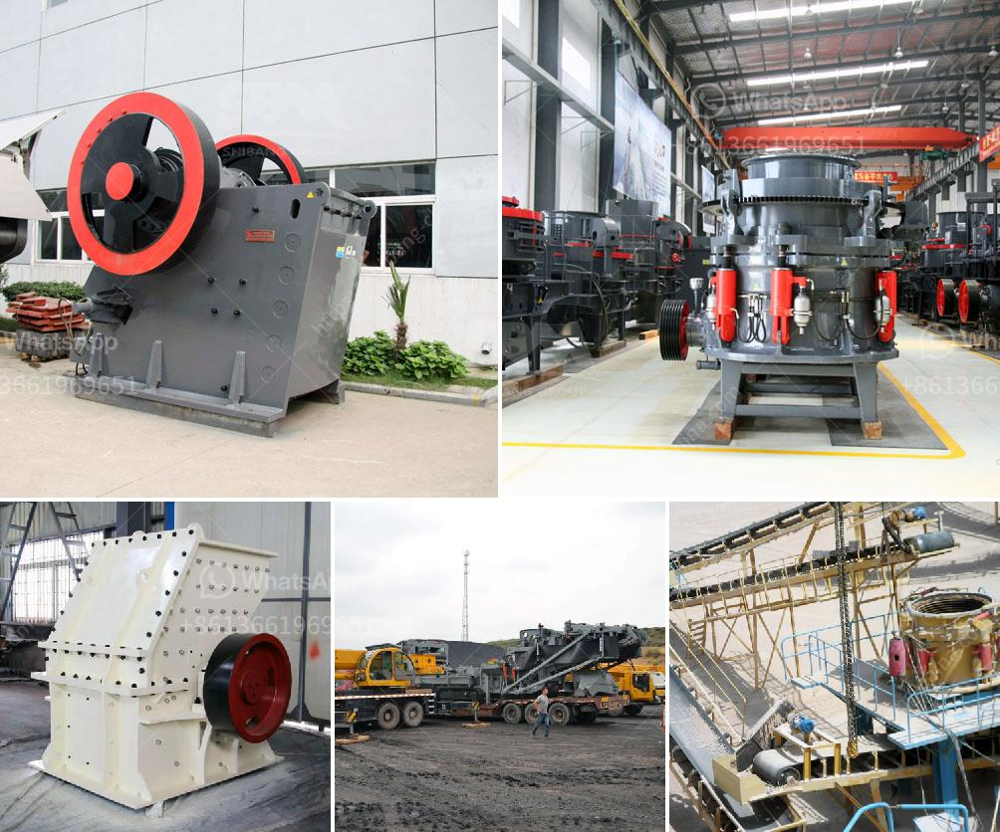

<h3>vibrating feeders in iron ore pelletization</h3>
Vibrating feeders play an important role in iron ore pelletization and processing. These devices are responsible for evenly distributing the feed material to each pelletizer disc, ensuring optimal pellet quality and production efficiency.

In iron ore pelletization, a wide range of feed materials, such as fine-grained iron ore, limestone, and silica, are used. Vibrating feeders are particularly well-suited for handling these types of materials, as they are low-maintenance and can accommodate varying feed rates.

One of the key advantages of vibrating feeders is their ability to handle large volumes of material, which is particularly important in iron ore processing. Vibrating feeders utilize vibrations to move and transport the feed material evenly along the feeder trough. This ensures a consistent flow of material to the pelletizer discs, preventing clogging and uneven distribution.

The consistent flow of material is critical in iron ore pelletization, as it directly impacts the quality of the pellets produced. Uneven distribution or clogging can lead to inconsistent pellet size, shape, and composition, affecting their strength and reducibility. Vibrating feeders help maintain the desired consistency, resulting in high-quality pellets that meet the required specifications.

Apart from ensuring even distribution, vibrating feeders can also be equipped with additional features to enhance the pelletization process. For example, they can be integrated with scalping screens to remove oversized particles or with fines screens to remove undersized particles. This further improves the quality of the feed material and increases the overall efficiency of the pelletization process.

In addition to their technical advantages, vibrating feeders offer several other benefits in iron ore pelletization. Their low maintenance requirements reduce downtime and operational costs. The robust construction of vibrating feeders makes them highly durable, allowing them to withstand the harsh conditions typically encountered in pelletization plants.

Furthermore, vibrating feeders can be easily customized to suit specific process requirements. They can be designed to handle different feed sizes, feed rates, and discharge points. This flexibility ensures compatibility with different pelletizer configurations, making them a versatile choice for iron ore pelletization plants.

When selecting vibrating feeders for iron ore pelletization, it is important to consider factors such as feed material characteristics, required feed rates, and reliability. Working with experienced vibrating feeder manufacturers can help ensure the right equipment is chosen for the specific application.

In conclusion, vibrating feeders are vital components in iron ore pelletization and processing. Their ability to evenly distribute the feed material ensures consistent pellet quality and improved production efficiency. With their low maintenance requirements, durability, and customizability, vibrating feeders are an ideal choice for pelletization plants looking to optimize their operations.
<h3>Contact us</h3><ul><li><strong>Whatsapp:&nbsp;<a href="https://wa.me/8613661969651">+8613661969651</a></strong></li><li><a href="https://swt.shibang-china.com/?git&amp;zhl&amp;vibrating feeders in iron ore pelletization"><strong>Online Service(chat now)</strong></a></li></ul><h3>Related</h3><ul><li><a href='balls for ball mill.md'>balls for ball mill</a></li><li><a href='cone crusher supplier.md'>cone crusher supplier</a></li><li><a href='iron crushing plant.md'>iron crushing plant</a></li><li><a href='iron ore crusher machine price.md'>iron ore crusher machine price</a></li><li><a href='cement vertical mill tph kenya.md'>cement vertical mill tph kenya</a></li></ul>