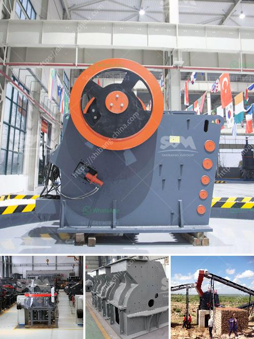

<h3>vibrating screen for 150 microns</h3>
The vibrating screen is a crucial piece of equipment in various industries including construction, mining, and mineral processing. Its purpose is to separate and classify materials by size, giving them the appropriate characteristics for their intended use. In this article, we will explore the vibrating screen specifically designed for materials with a size of 150 microns, discussing its working principle, benefits, and common applications.

The vibrating screen for 150 microns utilizes a vibratory motor, which exerts vibrations onto the screen mesh. As a result, the materials are separated into different sizes, allowing for efficient and accurate screening. The mesh size determines the size of the particles that can pass through the screen. In this case, the 150-micron mesh allows only materials smaller than 150 microns to pass through, while the larger particles are retained on the screen surface.

One of the key benefits of using a vibrating screen for 150 microns is its precision. With its high-frequency vibrations, it can accurately separate materials of different sizes. This precision is essential in industries where the size of the particles greatly influences the quality and performance of the end product. By effectively removing the undersized or oversized particles, the vibrating screen ensures that only the desired material is processed further.

Additionally, the vibrating screen for 150 microns offers high throughput rates and increased productivity. It allows for continuous operation and can handle large volumes of materials, making it suitable for industries with high production demands. The efficient screening process not only saves time but also minimizes material wastage. By only processing the correct size material, the vibrating screen helps reduce overall costs associated with material handling and processing.

The vibrating screen for 150 microns finds application in a wide range of industries. In the construction industry, it is commonly used for screening sand, gravel, and aggregates. By separating these materials based on size, construction companies can obtain specific gradations required for different types of concrete or asphalt mixtures.

Mining and mineral processing also benefit from the vibrating screen for 150 microns. It can efficiently separate minerals of various sizes, contributing to the overall extraction process. Additionally, the vibrating screen is utilized in processing plants to classify ores and other materials based on their particle size, enabling effective concentration and further refining.

Moreover, the vibrating screen for 150 microns has shown its significance in the pharmaceutical and chemical industries. These industries require precise separation of powders and granules to meet stringent quality requirements. The vibrating screen enables accurate particle size distribution and improved product consistency, crucial for pharmaceutical formulations and chemical reactions.

In conclusion, the vibrating screen for 150 microns is a vital equipment in various industries. Its precision, high throughput rates, and versatile applications make it an indispensable tool for efficient material separation. Whether used in construction, mining, or pharmaceuticals, this vibrating screen plays a crucial role in ensuring quality, productivity, and cost-effectiveness.
<h3>Contact us</h3><ul><li><strong>Whatsapp:&nbsp;<a href="https://wa.me/8613661969651">+8613661969651</a></strong></li><li><a href="https://swt.shibang-china.com/?git&amp;zhl&amp;vibrating screen for 150 microns"><strong>Online Service(chat now)</strong></a></li></ul><h3>Related</h3><ul><li><a href='grinding machine manufacturer for 300 mesh powder.md'>grinding machine manufacturer for 300 mesh powder</a></li><li><a href='stone hammer mill.md'>stone hammer mill</a></li><li><a href='roll wheel pulverizer.md'>roll wheel pulverizer</a></li><li><a href='favrica of ball mills.md'>favrica of ball mills</a></li><li><a href='marble processing machines.md'>marble processing machines</a></li></ul>