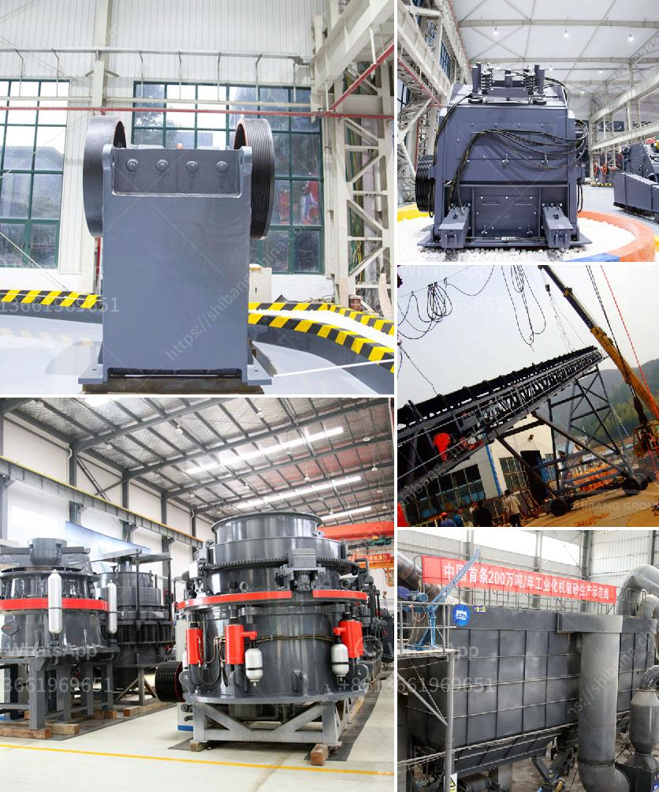

<h3>vibrating screening machine</h3>
Vibrating screening machines have become an integral part of various industries, enabling efficient and precise screening of materials. These machines are widely used in mining, pharmaceutical, chemical, and other industries to filter and separate materials based on their size. With their numerous benefits and technological advancements, vibrating screening machines have revolutionized material separation processes.

A vibrating screening machine consists of a screen mesh, vibratory motor, and a supporting structure. The screen mesh plays a crucial role in the screening process by separating larger particles from smaller ones. It is typically made of stainless steel or polyurethane and is available in various sizes and designs to cater to different materials and screening requirements.

One of the key advantages of vibrating screening machines is their ability to handle a wide range of materials. Whether it is wet or dry, fine or coarse, sticky or abrasive, these machines can efficiently screen them all. This versatility makes them ideal for use in various industries, where different types of materials need to be separated or classified.

Vibrating screening machines are designed to provide high screening efficiency. The vibratory motor generates vibrations, which cause the material to move across the screen, allowing the smaller particles to pass through while retaining the larger ones. This process ensures that the desired separation is achieved effectively and efficiently.

In addition to their high screening efficiency, vibrating screening machines offer several other benefits. They are compact and can be easily integrated into existing production lines. Their low maintenance requirements save time and resources, making them a cost-effective choice for industries. Furthermore, they have a long lifespan and can withstand harsh operating conditions, ensuring reliable and continuous performance.

With advancements in technology, vibrating screening machines have witnessed significant improvements. Many machines now feature advanced control systems that enable operators to adjust their settings according to their specific requirements. These control systems allow for precise control of the amplitude, frequency, and tilt of the screen, resulting in enhanced screening efficiency and accuracy.

Moreover, modern vibrating screening machines are equipped with anti-blinding devices. These devices prevent material blockages by reducing the adhesion of particles to the screen mesh. This ensures smooth and uninterrupted screening operations, minimizing downtime and increasing productivity.

The vibrating screening machine market has experienced significant growth in recent years, driven by the increasing demand for efficient material separation processes across various industries. Manufacturers are continually innovating and improving their machines to meet the evolving needs and requirements of customers. As a result, vibrating screening machines are becoming more advanced, reliable, and user-friendly.

In conclusion, vibrating screening machines have revolutionized the material separation processes across industries. Their ability to efficiently and precisely separate materials based on size, versatility, high screening efficiency, low maintenance requirements, and technological advancements have made them an essential tool for various applications. As industries continue to embrace automation and efficiency, the demand for vibrating screening machines is expected to further increase, driving the market for these machines in the years to come.
<h3>Contact us</h3><ul><li><strong>Whatsapp:&nbsp;<a href="https://wa.me/8613661969651">+8613661969651</a></strong></li><li><a href="https://swt.shibang-china.com/?git&amp;zhl&amp;vibrating screening machine"><strong>Online Service(chat now)</strong></a></li></ul><h3>Related</h3><ul><li><a href='mobile mineral processing gravity plants.md'>mobile mineral processing gravity plants</a></li><li><a href='limestone processing plant in benin.md'>limestone processing plant in benin</a></li><li><a href='malaysia used conveyor belt for sale.md'>malaysia used conveyor belt for sale</a></li><li><a href='vrm cement grinding.md'>vrm cement grinding</a></li><li><a href='production line chrome ore concentration plant mar.md'>production line chrome ore concentration plant mar</a></li></ul>