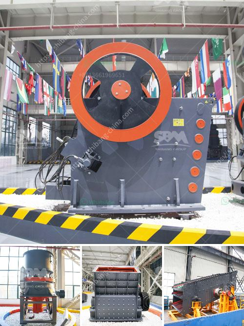

<h3>vibrating screens manufacturer south africa</h3>
Vibrating screens are used to separate bulk materials in a mixture of different sized particles. It is widely used in industries such as mining, quarrying, metallurgy, building material, construction, and many more. South Africa is a country that is rich in mineral resources and it has been a market for vibrating screens manufacturing for many years.

A vibrating screen manufacturer South Africa is a leading supplier in the country when it comes to the production of these screens. Vibrating screens are used in an array of different industries and applications, including mining, construction, drilling, and recycling. It is for this reason that a range of high-quality vibrating screens are manufactured and distributed across South Africa. These screens are manufactured using high-quality materials and are designed to withstand harsh working conditions, making them ideal for use in different industries and environments.

When choosing a vibrating screen manufacturer in South Africa, it is important to consider various factors. Firstly, one must consider the reputation and reliability of the manufacturer. This can be determined by researching customer reviews and obtaining feedback from previous clients. Additionally, it is essential to consider the quality of the vibrating screens being manufactured. This can be evaluated by enquiring about the materials used, the manufacturing process, and the quality control measures implemented by the manufacturer.

One of the leading vibrating screen manufacturers in South Africa is Vibramech. Vibramech's range of vibrating screens caters for a variety of different applications and industries, such as mining, quarrying, and recycling. These screens are designed to provide reliable and efficient operation, even in the most demanding conditions.

In conclusion, South Africa is a prominent player in the manufacturing of vibrating screens. The country boasts a range of reputable manufacturers who have been supplying the industry for years. When selecting a manufacturer, it is important to consider factors such as reputation, reliability, and the quality of the screens being produced. By doing so, businesses can ensure that they are investing in high-quality vibrating screens that will meet their specific requirements and deliver optimal performance.
<h3>Contact us</h3><ul><li><strong>Whatsapp:&nbsp;<a href="https://wa.me/8613661969651">+8613661969651</a></strong></li><li><a href="https://swt.shibang-china.com/?git&amp;zhl&amp;vibrating screens manufacturer south africa"><strong>Online Service(chat now)</strong></a></li></ul><h3>Related</h3><ul><li><a href='crusher plant in india.md'>crusher plant in india</a></li><li><a href='pe series jaw crusher rate 1000ton per hour.md'>pe series jaw crusher rate 1000ton per hour</a></li><li><a href='ceramic crushing production line.md'>ceramic crushing production line</a></li><li><a href='vibrating screening machine.md'>vibrating screening machine</a></li><li><a href='concrete crushing machines.md'>concrete crushing machines</a></li></ul>