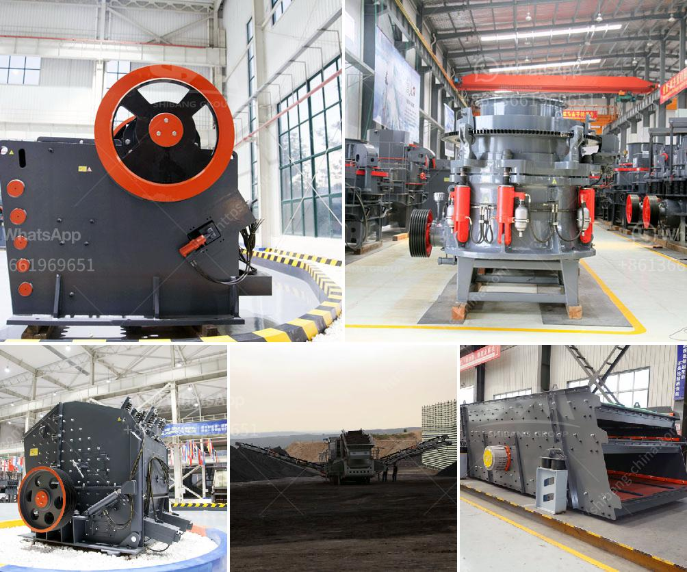

<h3>vrm cement grinding</h3>
With the introduction of the Vertical Roller Mill (VRM) in the late 20th century, manufacturers were finally able to offer cement producers a more efficient grinding method. VRM cement mill is now one of the main grinding systems used in cement plants across the world.

The first VRM was successfully put into operation in the United States in 1971. As renowned German cement plant manufacturer Loesche GmbH puts it, “VRM cement mills have been in operation for more than 20 years.” Furthermore, VRM grinding is now the industry standard for raw material, clinker, and slag grinding, with many new plants utilizing this technology.

So, what makes VRM cement grinding superior to traditional grinding methods? The key lies in its design and operating principle. The VRM consists of a rotating grinding table, which is supported by a set of rollers placed at a fixed distance. Material is fed into the grinding chamber and crushed between the grinding table and the rollers.

One of the major advantages of VRM cement grinding is its ability to grind materials at a lower energy consumption. This results in significant cost savings, as less energy is required to power the mill. Additionally, the VRM offers greater flexibility in grinding a range of materials, including raw meal, clinker, and slag.

Another benefit of VRM grinding is its ability to maintain a consistent product quality. The adjustable grinding pressure, combined with the excellent drying capability of the VRM, ensures a uniform and stable product output. This is particularly important for obtaining high-quality cement, which meets the stringent industry standards.

In terms of environmental impact, the VRM is also a more sustainable option. The lower energy consumption and reduced emission levels contribute to a greener cement production process. Moreover, the compact design of the VRM saves space, making it an ideal choice for plants with limited footprint.

In conclusion, VRM cement grinding has revolutionized the grinding process in the cement industry. Its efficiency and versatility provide numerous benefits, including lower energy consumption, consistent product quality, and reduced environmental impact. As this technology continues to evolve, VRM cement mills are destined to become even more prevalent in cement plants worldwide.
<h3>Contact us</h3><ul><li><strong>Whatsapp:&nbsp;<a href="https://wa.me/8613661969651">+8613661969651</a></strong></li><li><a href="https://swt.shibang-china.com/?git&amp;zhl&amp;vrm cement grinding"><strong>Online Service(chat now)</strong></a></li></ul><h3>Related</h3><ul><li><a href='crusher machine china.md'>crusher machine china</a></li><li><a href='cost of a stone crusher.md'>cost of a stone crusher</a></li><li><a href='gypsum production line in spain for sale.md'>gypsum production line in spain for sale</a></li><li><a href='crushing plants in malaysia.md'>crushing plants in malaysia</a></li><li><a href='iron crushing machine.md'>iron crushing machine</a></li></ul>