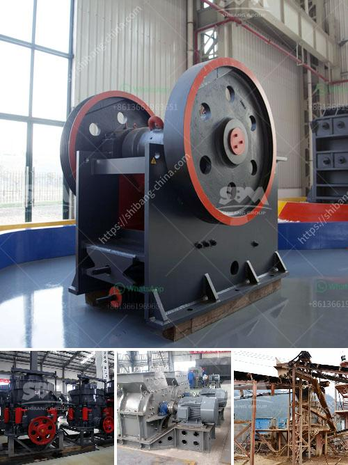

<h3>vsi crusher manufacturers</h3>
In the last few decades, the construction industry has witnessed a significant transformation, with technological advancements making their way into various stages of the building process. One area that has seen remarkable innovation is crushing equipment, which plays a crucial role in breaking down large rocks and stones into smaller, more manageable sizes for various construction applications. One of the key players in this industry is the VSI crusher, also known as the vertical shaft impact crusher.

VSI crushers have gained immense popularity in recent years due to their ability to crush a wide range of materials efficiently. These crushers utilize a high-speed rotor with wear-resistant tips to throw stone particles against a crushing chamber's walls, creating a rock-on-rock crushing action. As a result, they produce superior-shaped aggregates with fewer fines and ensure consistent gradation.

While the concept of VSI crushers is not new, the technology behind these machines has evolved significantly over time. This progress can be attributed to the relentless efforts of VSI crusher manufacturers who have been striving to improve their products' performance and efficiency. These manufacturers invest heavily in research and development to enhance their crushers' capabilities by incorporating advanced features and intelligent systems.

One of the key advancements in VSI crusher technology is the integration of artificial intelligence (AI) algorithms into the crushing process. AI-powered VSI crushers are equipped with sensors and monitoring systems that constantly analyze various parameters such as feed particle size, rotor speed, and chamber pressure. The collected data is then processed by AI algorithms, which optimize the crusher's operation in real-time.

This AI-powered intelligence allows VSI crushers to adapt to changing feed conditions and automatically adjust the crusher's settings to maximize performance and minimize downtime. For example, if the crusher senses a blockage in the feed, it can automatically adjust the rotor speed or open the crushing chamber to avoid overload. These intelligent crushers not only improve operational efficiency but also ensure better product quality and reduce maintenance costs.

Leading VSI crusher manufacturers are at the forefront of this AI revolution in the construction industry. They are constantly innovating and developing new crusher models equipped with advanced AI systems. These manufacturers work closely with construction companies and mining operators to understand their specific requirements and design crushers that deliver optimal results in different applications.

Moreover, VSI crusher manufacturers are focusing on sustainability and environmental friendliness by incorporating energy-efficient features into their machines. They are using state-of-the-art technologies to reduce power consumption and minimize carbon emissions. By continuously improving their crushers' energy efficiency, these manufacturers are contributing to the global efforts towards a greener and more sustainable construction industry.

In conclusion, VSI crusher manufacturers have brought a new era of technological innovation to the construction industry. Their relentless pursuit of excellence has resulted in the development of AI-powered crushers that deliver superior performance, efficiency, and sustainability. As this technology continues to evolve, we can expect further advancements that will revolutionize the crushing process and pave the way for a more efficient and sustainable construction industry.
<h3>Contact us</h3><ul><li><strong>Whatsapp:&nbsp;<a href="https://wa.me/8613661969651">+8613661969651</a></strong></li><li><a href="https://swt.shibang-china.com/?git&amp;zhl&amp;vsi crusher manufacturers"><strong>Online Service(chat now)</strong></a></li></ul><h3>Related</h3><ul><li><a href='cement factory for sale in andra pradesh.md'>cement factory for sale in andra pradesh</a></li><li><a href='equipment required for alluvial gold mining.md'>equipment required for alluvial gold mining</a></li><li><a href='hydraulic system loesche mill.md'>hydraulic system loesche mill</a></li><li><a href='sand conveyors for rent.md'>sand conveyors for rent</a></li><li><a href='want to buy stone crusher in canada.md'>want to buy stone crusher in canada</a></li></ul>