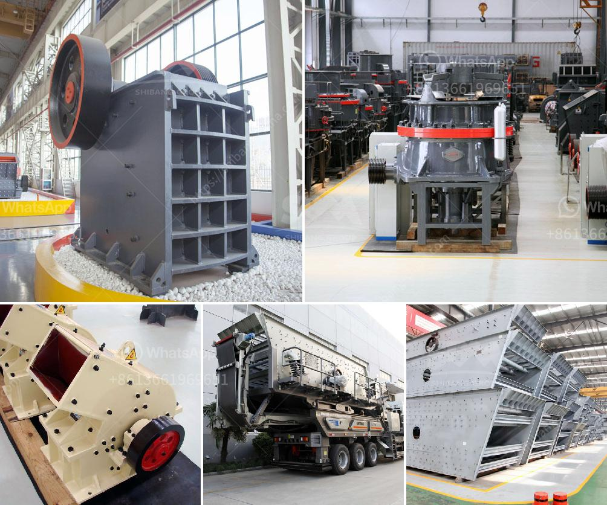

<h3>vsi crusher price</h3>
VSI crusher, or vertical shaft impactor crusher, works on the principle of centrifugal force. It utilizes the rotor to crush rocks against the walls of the crushing chamber. This unique crushing method enhances the size reduction resulting in a more consistent product shape with higher quality. Due to its numerous benefits, VSI crushers are widely used in the construction industry for producing crushed sand, better known as manufactured sand.

When considering the purchase of a VSI crusher, price is always an essential factor. Different manufacturers offer VSI crushers at various prices, depending on the features, capacity, and quality. The price range of VSI crushers is broad, from less than $10,000 up to several hundred thousand dollars.

Several factors influence the price of a VSI crusher. One key factor is the size of the crusher, with larger machines generally being more expensive. The production capacity also affects the cost, as higher capacity VSI crushers require more robust components, increasing manufacturing costs.

The quality and durability of the materials used in the construction of VSI crushers also impact the price. Higher quality materials, such as hardened steel and high-quality alloys, are more expensive but result in a longer lifespan and better overall performance. Additionally, features like anti-corrosion coatings and advanced sealing systems can increase the price but often justify the investment by extending the crusher's operational life.

The brand reputation of the manufacturer can also affect the price of a VSI crusher. Well-established brands with a proven track record of producing reliable equipment usually charge higher prices due to their reputation and customer trust. However, it is important not to overlook lesser-known brands that offer competitive prices while still providing reliable and efficient machinery.

Another factor that can influence the price is the level of after-sales service and support provided by the manufacturer. VSI crushers, like any other machinery, may require regular maintenance, repairs, and spare parts. Manufacturers that offer comprehensive after-sales service, technical support, and readily available spare parts may charge a premium price compared to those with limited support options.

When comparing prices of VSI crushers, it is crucial to consider the long-term cost of ownership. Cheaper initial purchase prices may result in higher costs in the form of frequent breakdowns, extensive maintenance, and expensive spare parts. Therefore, it is advisable to strike a balance between the initial purchase price and the overall cost of ownership to ensure a cost-effective investment.

In conclusion, the price of a VSI crusher can vary significantly depending on factors such as size, capacity, materials used, brand reputation, and after-sales support. It is essential to thoroughly research and compare different options to find the best value for money. Careful consideration of the long-term cost of ownership is also crucial to avoid any surprise expenses down the line. With proper analysis and informed decision-making, businesses can find a VSI crusher that meets their needs within their budget.
<h3>Contact us</h3><ul><li><strong>Whatsapp:&nbsp;<a href="https://wa.me/8613661969651">+8613661969651</a></strong></li><li><a href="https://swt.shibang-china.com/?git&amp;zhl&amp;vsi crusher price"><strong>Online Service(chat now)</strong></a></li></ul><h3>Related</h3><ul><li><a href='roller mill china.md'>roller mill china</a></li><li><a href='hydraulic cone crusher price.md'>hydraulic cone crusher price</a></li><li><a href='clay graphite grinding process.md'>clay graphite grinding process</a></li><li><a href='gold ore rock processing equipment price.md'>gold ore rock processing equipment price</a></li><li><a href='bauxite from cement plants in india.md'>bauxite from cement plants in india</a></li></ul>