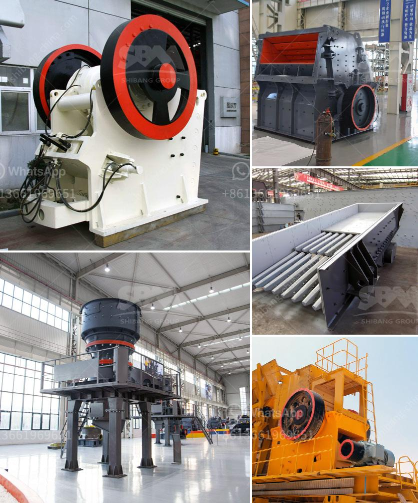

<h3>want to buy stone crusher in canada</h3>
Are you looking for a stone crusher to process your construction waste and make it reusable? There are a variety of machines in the market that can perform this task, but finding one that meets your requirements can be challenging. If you are based in Canada and are in need of a stone crusher, this article will provide you with useful information on how to find the right one for your project.

Firstly, it is important to determine the capacity you require. A stone crusher with a higher processing capacity will be able to handle larger chunks of material efficiently, saving you time and resources. Depending on the size of your project, you might need a crusher that can process between 100 to 300 tons of material per hour. Make sure to choose a crusher that can meet your specific needs.

Secondly, consider the type of stone crusher you need. There are different types of crushers available in the market, including jaw crushers, impact crushers, cone crushers, and more. Each type serves a specific purpose, so it is important to understand the differences and choose the one that is most suitable for your needs. For example, if you need a crusher for primary crushing, a jaw crusher might be the best option. However, if you are looking to produce finer particles, an impact crusher could be more suitable.

In addition, it is crucial to find a reliable supplier or manufacturer to purchase your stone crusher from. Look for companies that have a good reputation and offer high-quality, durable machines. You can search online for reviews and testimonials from other customers to ensure you are making the right choice. Additionally, check if the supplier offers after-sales support and maintenance services, as this can be important for the longevity and functionality of your crusher.

Finally, consider your budget. Stone crushers can vary in price depending on their features and capabilities. It is important to set a budget and stick to it. Compare prices from different suppliers and choose one that offers a good balance between affordability and quality.

In conclusion, finding the right stone crusher in Canada can be a daunting task, but with some careful planning and consideration of your needs, it can be done. Determine your desired processing capacity, choose the right type of crusher, find a reputable supplier, and stay within your budget. With these factors in mind, you will be well on your way to finding the perfect stone crusher for your project.
<h3>Contact us</h3><ul><li><strong>Whatsapp:&nbsp;<a href="https://wa.me/8613661969651">+8613661969651</a></strong></li><li><a href="https://swt.shibang-china.com/?git&amp;zhl&amp;want to buy stone crusher in canada"><strong>Online Service(chat now)</strong></a></li></ul><h3>Related</h3><ul><li><a href='vibrating screen for 150 microns.md'>vibrating screen for 150 microns</a></li><li><a href='coal processing plant in australia.md'>coal processing plant in australia</a></li><li><a href='portable rock crusher for sale.md'>portable rock crusher for sale</a></li><li><a href='quarry machinery for sale.md'>quarry machinery for sale</a></li><li><a href='crusher machine south africa.md'>crusher machine south africa</a></li></ul>