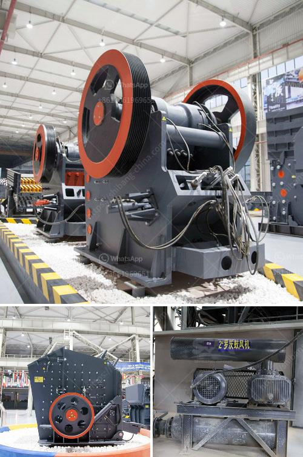

<h3>wanted 120 ton of stone crusher</h3>
Are you in need of a stone crusher? Do you have a construction project that requires a large amount of crushed stone? Look no further, as we have the perfect solution for you. We are excited to announce that we have the equipment you need, the stone crusher you've been searching for – a machine capable of crushing 120 tons of stone.

A stone crusher is a machine that reduces rocks into smaller pieces. Imagine a machine that takes large rocks and crushes them into tiny particles. It is indeed a fascinating process – crushing large stones into smaller ones and transforming them into gravel and sand.

Whether you're looking to build roads, renovate buildings, or develop infrastructure, a stone crusher is an essential tool in any construction project. With its ability to crush hard and abrasive materials, such as granite, basalt, and limestone, it is incredibly versatile and can handle a wide range of applications.

But why choose a stone crusher capable of crushing 120 tons of stone? The answer is simple – efficiency and productivity. This heavy-duty machine can process massive amounts of materials in a relatively short amount of time, saving you both time and money. With its 120-ton capacity, you can easily meet the demands of your project and ensure a smooth construction process.

Furthermore, our stone crusher is designed with the latest technology to enhance its performance and durability. It comes with advanced features that increase productivity, such as a large feed opening, high crushing ratio, and reliable operation. Additionally, it is equipped with a powerful motor that ensures efficient crushing and minimal downtime.

In terms of safety, our stone crusher meets the highest standards. It is designed with safety guards and emergency stop buttons to prevent accidents and protect the operator. We prioritize the safety of our customers and strive to provide reliable and secure equipment.

Aside from its powerful crushing capabilities, our stone crusher is also eco-friendly. It incorporates various features to minimize environmental impact, such as low noise levels and dust suppression systems. We understand the importance of sustainability in today's world and make sure our machinery aligns with global environmental standards.

Furthermore, our machine is easy to operate and maintain. It is equipped with user-friendly controls and a simple maintenance system, ensuring that anyone can effectively operate and maintain it. We provide comprehensive training and support to our customers, ensuring they can use our equipment with confidence.

If you're ready to take your construction project to the next level, look no further than our stone crusher. With its 120-ton capacity, efficiency, and durable design, it is the perfect solution for all your crushing needs. Enhance your productivity and complete your projects on time with our reliable machine.

Contact us today to learn more about our stone crusher and discuss your specific requirements. Our team of experts is ready to provide you with all the information you need and guide you through the process of acquiring this essential equipment. Don't wait – make the smart choice and invest in a stone crusher that exceeds your expectations.
<h3>Contact us</h3><ul><li><strong>Whatsapp:&nbsp;<a href="https://wa.me/8613661969651">+8613661969651</a></strong></li><li><a href="https://swt.shibang-china.com/?git&amp;zhl&amp;wanted 120 ton of stone crusher"><strong>Online Service(chat now)</strong></a></li></ul><h3>Related</h3><ul><li><a href='bauxite crusher equipment.md'>bauxite crusher equipment</a></li><li><a href='static jaw crusher for sale.md'>static jaw crusher for sale</a></li><li><a href='price of zenith mining.md'>price of zenith mining</a></li><li><a href='super fine powder grinder.md'>super fine powder grinder</a></li><li><a href='gypsum production line used.md'>gypsum production line used</a></li></ul>