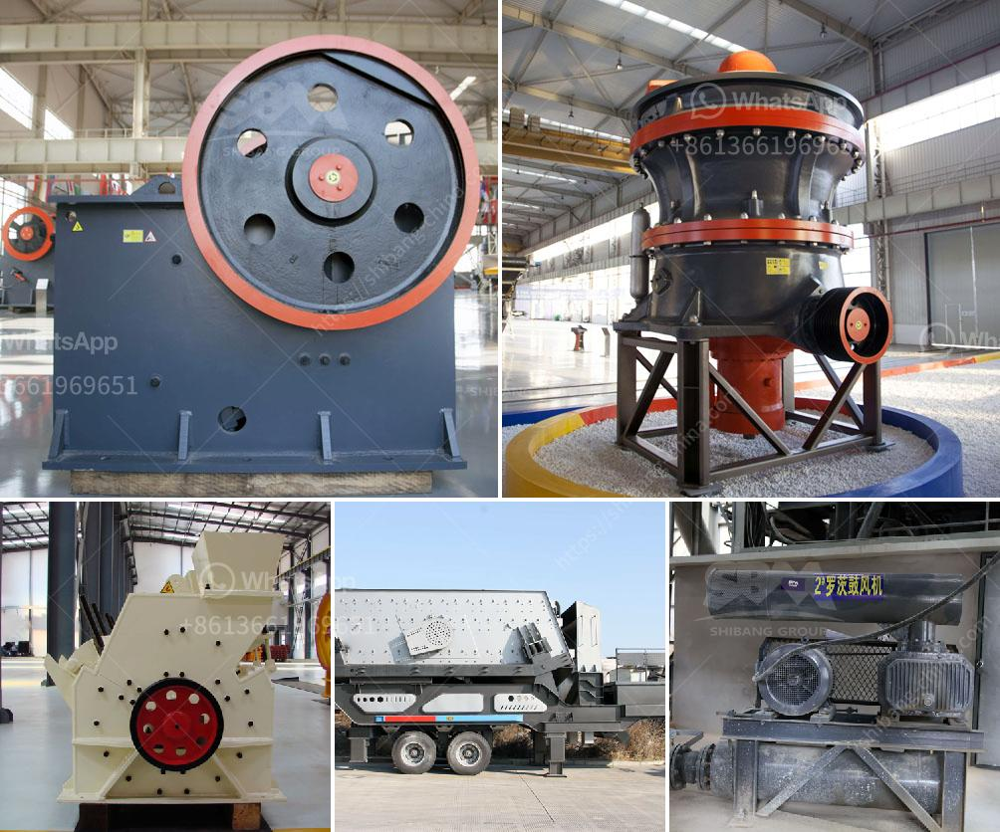

<h3>washing plant supplier in mozambique</h3>
As Mozambique continues to witness rapid industrialization and urbanization, the need for efficient infrastructure and reliable supplies for various industries becomes paramount. One industry that plays a crucial role in supporting the country's infrastructural development is the washing plant industry. Washing plant suppliers have become vital partners for Mozambique's construction and mining sectors, providing essential equipment and solutions for cleaning and processing materials. This article explores the increasing demand for washing plant suppliers and highlights some key players in the industry.

Mozambique's construction and mining sectors are experiencing unprecedented growth, driven by government initiatives and foreign investments. The construction industry, in particular, is expanding rapidly to cater to the country's infrastructure development projects, such as roads, railways, buildings, and ports. Similarly, the mining sector, which includes coal, gold, titanium, and precious stones, is witnessing a surge in exploration and production activities.

Washing plants are essential for cleaning and processing raw materials, such as aggregates, sand, stones, and ores. These plants play a crucial role in preparing materials for construction projects and extracting valuable minerals from mining sites. Washing plants help remove impurities, separate different sizes of materials, and improve the overall quality of the end product. Additionally, these plants also contribute to environmental conservation by recycling water and reducing waste.

Terex is a well-known global supplier of washing plants, offering a wide range of equipment for construction and mining industries. Their comprehensive product portfolio includes modular wash plants, log washers, sand screws, cyclones, and dewatering screens. Terex Washing Systems focuses on delivering efficient, cost-effective, and sustainable washing solutions to meet Mozambique's growing demands.

CDE Global is a renowned manufacturer of washing equipment, specializing in sustainable mineral processing solutions. Their innovative approach toward washing plant technology ensures reduced power consumption, water usage, and environmental impact. CDE Global's customized plant designs cater to the specific requirements of Mozambique's construction and mining sectors.

Baioni Crushing Plants is recognized for its expertise in designing and manufacturing washing plants for various applications, including aggregates, mining, and recycling. The company offers a wide range of products, such as sand recovery units, water clarification plants, and sludge treatment systems. Baioni Crushing Plants' commitment to research and development ensures cutting-edge technology and efficient washing solutions for Mozambique's industries.

As Mozambique witnesses exponential growth in its construction and mining sectors, the demand for washing plant suppliers is escalating. These suppliers provide the necessary equipment and technologies to support the country's infrastructural development and mineral extraction, ensuring high-quality materials and sustainable practices. Companies like Terex Washing Systems, CDE Global, and Baioni Crushing Plants are leading the way in catering to Mozambique's washing plant requirements, offering innovative, cost-effective, and environmentally friendly solutions. Their contribution is invaluable as Mozambique strives toward economic progress and sustainable development.
<h3>Contact us</h3><ul><li><strong>Whatsapp:&nbsp;<a href="https://wa.me/8613661969651">+8613661969651</a></strong></li><li><a href="https://swt.shibang-china.com/?git&amp;zhl&amp;washing plant supplier in mozambique"><strong>Online Service(chat now)</strong></a></li></ul><h3>Related</h3><ul><li><a href='mobile mineral processing gravity plants.md'>mobile mineral processing gravity plants</a></li><li><a href='crushing aggregates companies in philippines.md'>crushing aggregates companies in philippines</a></li><li><a href='lum vertical mill.md'>lum vertical mill</a></li><li><a href='types of ball mills.md'>types of ball mills</a></li><li><a href='hammer mill for ldpe grinding.md'>hammer mill for ldpe grinding</a></li></ul>