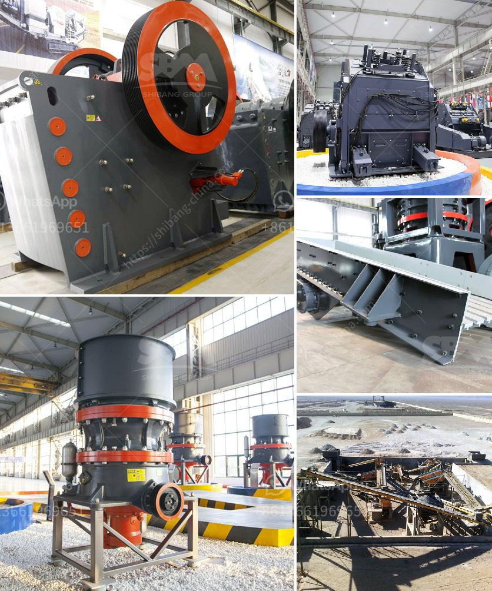

<h3>wet process of cement</h3>
The wet process of cement, also known as the wet method, is considered the oldest and most commonly used method for producing cement. This process starts with the extraction and grinding of the raw materials used for making cement, such as limestone and clay. The raw materials are then mixed with water in a tube mill and transformed into a slurry.

In the wet process, the slurry is pumped into storage tanks, where it is kept for several hours to allow hydration to occur. Hydration is the chemical reaction between the cement and water, which results in the formation of hard crystals that bind the aggregates together. This process is essential for the solidification and hardening of the cement.

The next step in the wet process involves separating unwanted solid materials, such as rocks and particles, from the slurry. This is typically done using a cyclone system, which relies on centrifugal force to separate the heavier particles from the lighter ones. The remaining slurry is then transferred to kilns for further processing.

The slurry is fed into kilns at high temperatures, ranging from 1,400 to 1,500 degrees Celsius. The intense heat causes the water in the slurry to evaporate and the raw materials to undergo chemical reactions. As a result, clinker is produced, which is a nodular material that serves as the key ingredient for making cement.

Once the clinker has been produced, it is finely ground with gypsum to produce cement powder. The addition of gypsum helps to regulate the setting time of the cement and enhances its strength and durability. This fine powder is then stored in silos until it is ready to be transported and used for various construction purposes.

While the wet process of cement production is known to be energy-intensive and requires a significant amount of water, it offers several advantages. Firstly, it allows for the production of high-quality cement with consistent and reliable properties. Secondly, it enables better control over the composition and characteristics of the cement produced. Additionally, the wet process can accommodate a wide range of raw materials, making it more versatile compared to other cement production methods.

In conclusion, the wet process of cement is an age-old method that involves grinding raw materials to create a slurry, which is then hydrated, separated, and transformed into clinker. Despite its drawbacks, this process has stood the test of time and remains a popular choice for cement production due to its ability to produce high-quality and customizable cement.
<h3>Contact us</h3><ul><li><strong>Whatsapp:&nbsp;<a href="https://wa.me/8613661969651">+8613661969651</a></strong></li><li><a href="https://swt.shibang-china.com/?git&amp;zhl&amp;wet process of cement"><strong>Online Service(chat now)</strong></a></li></ul><h3>Related</h3><ul><li><a href='how to start a concrete block business.md'>how to start a concrete block business</a></li><li><a href='start m sand unit kerala cost.md'>start m sand unit kerala cost</a></li><li><a href='portable rock crusher.md'>portable rock crusher</a></li><li><a href='mining jaw crusher pe.md'>mining jaw crusher pe</a></li><li><a href='limestone processing flow sheet.md'>limestone processing flow sheet</a></li></ul>