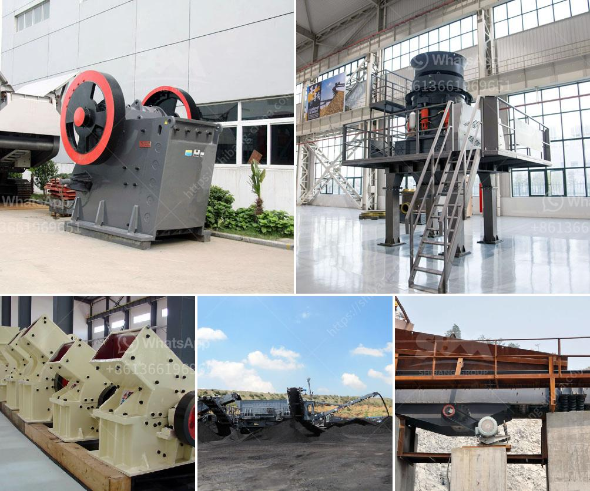

<h3>what are they vertical grinding mills</h3>
Vertical grinding mills are designed to break down solid material into smaller pieces. These mills use the force of gravity and the power of centrifugal force to grind the material, making them more efficient than traditional horizontal mills.

Vertical grinding mills are commonly used in industries such as mining, cement, and power generation. They can process many different types of materials, including limestone, clinker, coal, and slag. The mills are versatile and can be used for both dry and wet grinding.

One of the key advantages of vertical grinding mills is their energy efficiency. Due to the design of the mill, energy consumption is significantly reduced compared to traditional horizontal mills. This is because the material is ground through multiple passages, ensuring that all particles are properly and efficiently ground. Additionally, the mills are equipped with optimized grinding media, ensuring the highest grinding efficiency possible.

Another advantage of vertical grinding mills is their compact size. Unlike horizontal mills, which have a larger footprint, vertical mills can fit into smaller spaces. This makes them ideal for locations where space is limited or costly. The smaller size also means that transportation and installation costs are lower, making them a cost-effective solution for many industries.

Vertical grinding mills also offer the advantage of a lower maintenance footprint. The mills are typically equipped with maintenance-free grinding roller assemblies and a fixed media optimization system. This reduces the need for frequent maintenance and ensures that the mill operates at optimal performance for extended periods. Additionally, the mills are designed with ease of access in mind, allowing for quick inspection and replacement of parts when necessary.

With the advancement of technology, vertical grinding mills have also seen improvements in their control systems. Many mills now feature advanced control systems that allow for precise control of the grinding process. This ensures consistent and reliable operation, improving overall plant efficiency.

In conclusion, vertical grinding mills are a versatile and efficient solution for grinding various materials in industries such as mining, cement, and power generation. With their compact size, energy efficiency, and lower maintenance requirements, these mills offer a cost-effective and reliable solution for many applications. As technology continues to advance, we can expect further improvements in the performance and capabilities of vertical grinding mills.
<h3>Contact us</h3><ul><li><strong>Whatsapp:&nbsp;<a href="https://wa.me/8613661969651">+8613661969651</a></strong></li><li><a href="https://swt.shibang-china.com/?git&amp;zhl&amp;what are they vertical grinding mills"><strong>Online Service(chat now)</strong></a></li></ul><h3>Related</h3><ul><li><a href='crushing plant for aggregate india.md'>crushing plant for aggregate india</a></li><li><a href='roller crusher for coal.md'>roller crusher for coal</a></li><li><a href='pf series impact crusher.md'>pf series impact crusher</a></li><li><a href='construction debris recycling.md'>construction debris recycling</a></li><li><a href='products lm vertical grinding mills.md'>products lm vertical grinding mills</a></li></ul>