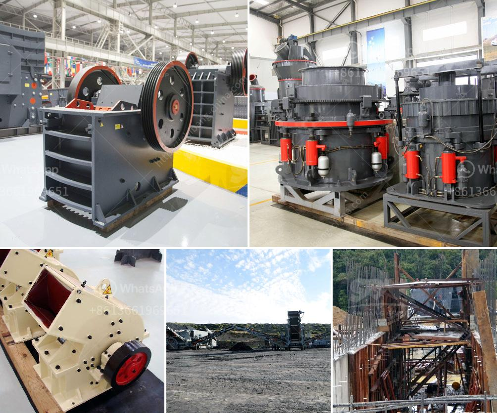

<h3>what is cost for putting up a 2500 tpd cement plant</h3>
The cement industry is one of the most lucrative industries in the construction sector, with a significant growth potential in the coming years. The demand for cement is constantly rising due to the rapid urbanization and industrialization around the world. Setting up a cement plant is both time and resource-intensive; it requires substantial capital investment, labor, and raw materials.

One of the primary factors that determine the cost of setting up a cement plant is the availability and cost of the raw materials required; mainly limestone, coal, gypsum, and clay. Most cement plants are located near the limestone deposits, as it is the main component for cement production. Without an abundant and easily accessible limestone supply, setting up a cement manufacturing plant would be near impossible.

Apart from the raw materials, other cost factors that significantly contribute to the overall cost of setting up a cement plant include land, labor, power, and transportation expenses. Acquiring suitable land is crucial for establishing a cement plant. The land should be strategically located near the target market and possess adequate space for all the necessary plant infrastructure. The cost of land varies greatly depending on the location and proximity to limestone reserves.

Labor is another major cost component for setting up a cement plant. The project requires skilled and unskilled manpower in various departments such as production, maintenance, administration, finance, and marketing. The cost of labor depends on the geographical location and prevailing wage rates in the region.

Power and fuel costs also constitute a significant portion of the overall cost. Cement production is energy-intensive, and a 2500 tpd (tonnes per day) cement plant requires around 3.5-4.0 MW of power. The total power consumption for a cement plant depends on the availability and cost of the power supply in the area where it is located. Additionally, the type of fuel used for powering the plant also affects the operating costs. Most cement plants use coal as a fuel source, but alternative fuels like natural gas and petroleum coke can also be used.

Transportation costs can vary depending on the distance between the plant and the market. Cement is a bulky and heavy product, which makes transportation costs a significant concern. Developing close proximity to the target market can help reduce transportation costs and provide a competitive advantage.

Taking all these factors into account, the cost for putting up a 2500 tpd cement plant can range from $150 million to $300 million or more. It is important to note that these costs are rough estimates and can vary depending on several factors such as location, size of the plant, technology used, and market conditions. Additionally, it is essential to conduct a thorough feasibility study and engage experienced professionals to accurately estimate the project cost before initiating any investment.

In conclusion, setting up a cement manufacturing plant requires substantial capital investment and careful planning. The cost for putting up a 2500 tpd cement plant can be substantial, considering the various factors such as raw material availability, labor, power, and transportation expenses. However, with the growing demand for cement and potential profitability, establishing a cement plant can be a fruitful and rewarding venture for investors in the long run.
<h3>Contact us</h3><ul><li><strong>Whatsapp:&nbsp;<a href="https://wa.me/8613661969651">+8613661969651</a></strong></li><li><a href="https://swt.shibang-china.com/?git&amp;zhl&amp;what is cost for putting up a 2500 tpd cement plant"><strong>Online Service(chat now)</strong></a></li></ul><h3>Related</h3><ul><li><a href='top roller mills for sale.md'>top roller mills for sale</a></li><li><a href='suppliers of mining equipment in south africa.md'>suppliers of mining equipment in south africa</a></li><li><a href='jaw crusher size specifications.md'>jaw crusher size specifications</a></li><li><a href='bauxite crusher manufacturer in china mill gold.md'>bauxite crusher manufacturer in china mill gold</a></li><li><a href='gold stamp mills in zimbabwe.md'>gold stamp mills in zimbabwe</a></li></ul>