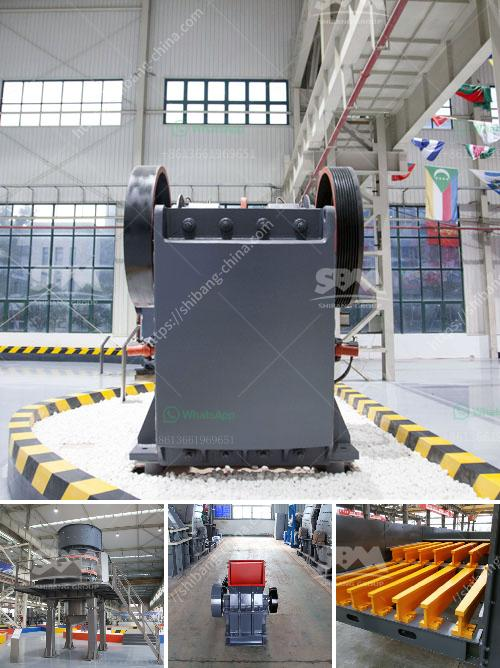

<h3>working cone crushers</h3>
Cone crushers are widely used in the mining and aggregate industries for reducing the size of materials, which are often abrasive. Their basic design consists of a rotating mantle with a crushing cavity that extends vertically downward. To ensure efficient operation, cone crushers require accurate feed material and consistent pressure throughout the crushing chamber.

When a cone crusher is fed with material, it passes through a chamber that builts up pressure due to the narrowing of the crushing cavity. This enables the materials to be crushed as they reach the smallest point. The rotating motion of the mantle ensures a continuous crushing process by constantly squeezing the material against the concave bowl liner. This action breaks the particles and enables them to move further down the chamber until they are small enough to pass through the discharge opening.

Cone crushers can be powered by electric motors or diesel engines, depending on the application and the power source available. They generally consist of a fixed main shaft, over which the mantle revolves, and a movable eccentric cone which is driven by a gear and pinion system. The rotating motion of the eccentric cone causes the mantle to oscillate, providing the crushing action.

To optimize the performance of a cone crusher, it is important to have a well-graded feed material, meaning the size distribution of the material should be as per the specifications. This is achieved through proper screening and classification processes prior to feeding the crusher. Additionally, the crusher's wear parts, such as the mantle and concave bowl liner, should be regularly inspected and replaced if necessary to maintain the desired crushing efficiency.

In conclusion, cone crushers are powerful machines that can help in reducing the size of abrasive materials efficiently. Their working principle involves a rotating mantle and a crushing cavity, which together provide a continuous crushing process. However, to ensure optimal performance, proper feed material and regular maintenance of wear parts are essential. Cone crushers offer a reliable solution for various crushing needs in the mining and aggregate industries.
<h3>Contact us</h3><ul><li><strong>Whatsapp:&nbsp;<a href="https://wa.me/8613661969651">+8613661969651</a></strong></li><li><a href="https://swt.shibang-china.com/?git&amp;zhl&amp;working cone crushers"><strong>Online Service(chat now)</strong></a></li></ul><h3>Related</h3><ul><li><a href='part of ball mills.md'>part of ball mills</a></li><li><a href='grinding and mixing machine for quartz.md'>grinding and mixing machine for quartz</a></li><li><a href='small cement grinding plant.md'>small cement grinding plant</a></li><li><a href='stone crusher machine in zimbabwe.md'>stone crusher machine in zimbabwe</a></li><li><a href='cost of crushing equipments in nigeria.md'>cost of crushing equipments in nigeria</a></li></ul>