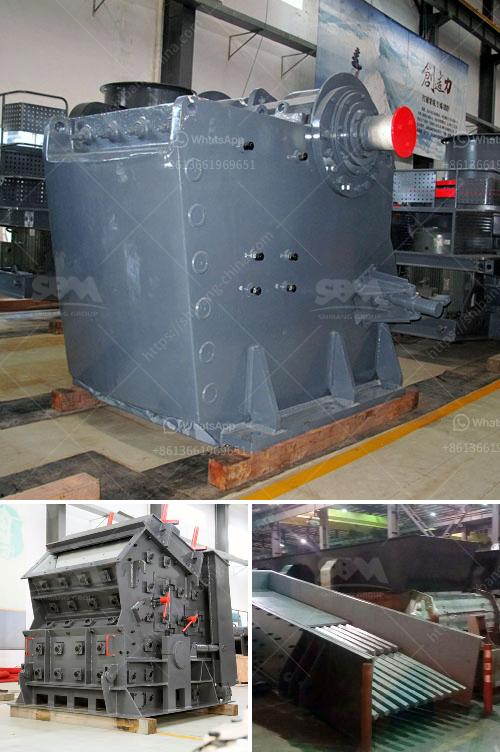

<h3>ykn vibrating screen manufacturer</h3>
When it comes to enhancing the efficiency and productivity of various industrial processes, having the right equipment is crucial. One key component in many processing operations is the vibrating screen, which efficiently separates materials based on their size and composition. In this article, we will be exploring the features and benefits offered by a leading manufacturer in this field, YKN Vibrating Screen Manufacturer.

YKN Vibrating Screen Manufacturer is a renowned company known for its innovation and expertise in providing top-quality vibrating screens to diverse industries. With a rich history spanning many years, the company has consistently focused on improving their products and services to meet the evolving needs of their customers.

One of the distinguishing features of YKN Vibrating Screen Manufacturer is their commitment to delivering customized solutions. They understand that every processing operation is unique, with specific requirements and constraints. Therefore, they work closely with their clients to understand their needs and tailor their products accordingly. By offering customizations in terms of screen size, mesh size, and screen deck configuration, YKN Vibrating Screen Manufacturer ensures that their clients receive the most suitable equipment for their specific application.

Another key strength of YKN Vibrating Screen Manufacturer is their use of advanced technology and cutting-edge manufacturing processes. Their vibrating screens are designed using state-of-the-art software, which simulates and optimizes the screen's performance for various materials and operating conditions. This enables the company to produce screens that deliver exceptional efficiency and accuracy in material separation.

Additionally, YKN Vibrating Screen Manufacturer pays great attention to the quality of their products. They source high-quality raw materials and carry out rigorous quality control checks throughout the manufacturing process. This ensures that their vibrating screens are durable, reliable, and able to withstand the demanding conditions of industrial operations. As a result, customers can expect long-lasting performance and minimal downtime, ultimately leading to increased productivity and cost savings.

Furthermore, YKN Vibrating Screen Manufacturer boasts a comprehensive after-sales service program. Their team of experienced technicians provides installation, maintenance, and troubleshooting support to their clients, ensuring that the equipment continues to operate at its optimum level throughout its lifespan. This commitment to customer support has earned the company a reputation for being a trusted partner in the industry.

In conclusion, YKN Vibrating Screen Manufacturer is a reliable and innovative provider of screening solutions. Their commitment to customization, advanced technology, and superior quality ensures that customers receive vibrating screens that are tailored to their needs and deliver exceptional performance. With their comprehensive after-sales service program, YKN Vibrating Screen Manufacturer goes the extra mile to ensure customer satisfaction. Whether it's for mining, construction, or any other industry, partnering with YKN Vibrating Screen Manufacturer guarantees enhanced efficiency and productivity in materials separation.
<h3>Contact us</h3><ul><li><strong>Whatsapp:&nbsp;<a href="https://wa.me/8613661969651">+8613661969651</a></strong></li><li><a href="https://swt.shibang-china.com/?git&amp;zhl&amp;ykn vibrating screen manufacturer"><strong>Online Service(chat now)</strong></a></li></ul><h3>Related</h3><ul><li><a href='types of crushing machine.md'>types of crushing machine</a></li><li><a href='5hp industrial crusher mill.md'>5hp industrial crusher mill</a></li><li><a href='price of zenith mining.md'>price of zenith mining</a></li><li><a href='iron ore used crusher machine.md'>iron ore used crusher machine</a></li><li><a href='crushed stone plant peru.md'>crushed stone plant peru</a></li></ul>