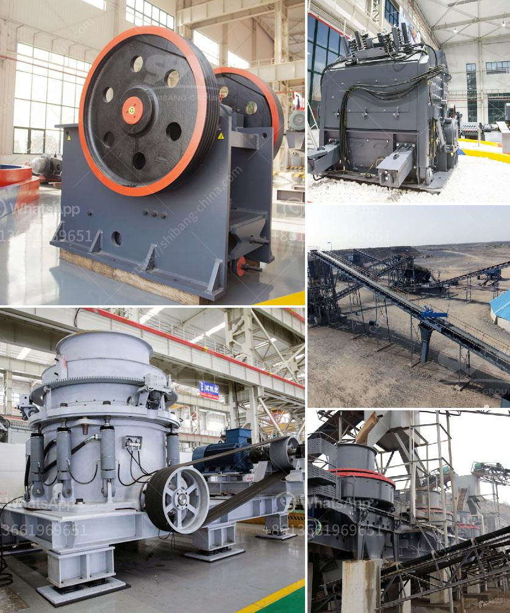

<h3>zevith simple stone crushers kenya</h3>
In today's fast-paced and constantly evolving world, efficiency and productivity are key factors in any business operation. This rings especially true for industries that rely heavily on crushing and grinding, such as mining, construction, and demolition. In Kenya, a country known for its thriving mining sector, finding innovative and cost-effective solutions for crushing stone materials has become crucial. This is where Zevith Simple Stone Crushers Kenya comes into play.

Zevith Simple Stone Crushers Kenya is a leading manufacturer and supplier of high-quality stone crushing machines in Kenya. Their machines are suitable for crushing a wide range of materials, including granite, basalt, limestone, river stone, iron ore, and more. With high crushing efficiency and low operation costs, their machines have been widely used by businesses in Kenya and beyond.

One of the key features of Zevith Simple Stone Crushers Kenya is their simplicity. Unlike many other crushing machines on the market, their machines are designed with simplicity in mind. This makes them easy to operate and maintain, even for those with limited technical knowledge. The machines also feature a sturdy construction and high-quality components, ensuring their durability and reliability.

Another advantage of choosing Zevith Simple Stone Crushers Kenya is their cost-effectiveness. The prices of their machines are competitive, making them an excellent choice for businesses of all sizes, regardless of their budget constraints. The low operating costs of their machines further contribute to the cost-effectiveness, allowing businesses to save on their operational expenses.

Zevith Simple Stone Crushers Kenya offers a wide range of models to cater to different crushing needs. Whether you need a small-scale machine for a small construction project or a large-scale machine for heavy-duty mining operations, they have got you covered. Their machines are designed to deliver optimum performance and efficiency, ensuring that your crushing needs are met without any compromises.

Furthermore, Zevith Simple Stone Crushers Kenya provides excellent after-sales support to their customers. They have a team of experienced technicians who are always ready to assist you in case of any technical issues or maintenance needs. This ensures that your machines stay in top condition, maximizing their lifespan and performance.

In conclusion, Zevith Simple Stone Crushers Kenya is a reliable and efficient solution for your stone crushing needs. With their easy-to-use machines, cost-effectiveness, and excellent after-sales support, they are the go-to choice for businesses in Kenya and beyond. Whether you are in the mining, construction, or demolition industry, investing in their machines will undoubtedly enhance your operational efficiency and productivity. So, if you are in need of high-quality stone crushing machines, look no further than Zevith Simple Stone Crushers Kenya.
<h3>Contact us</h3><ul><li><strong>Whatsapp:&nbsp;<a href="https://wa.me/8613661969651">+8613661969651</a></strong></li><li><a href="https://swt.shibang-china.com/?git&amp;zhl&amp;zevith simple stone crushers kenya"><strong>Online Service(chat now)</strong></a></li></ul><h3>Related</h3><ul><li><a href='difference between pulveriser and.md'>difference between pulveriser and</a></li><li><a href='china gold dry washer manufacturer in australia.md'>china gold dry washer manufacturer in australia</a></li><li><a href='material vibrator feeder.md'>material vibrator feeder</a></li><li><a href='basalt crusher machine prices.md'>basalt crusher machine prices</a></li><li><a href='cost of mobile stone crusher.md'>cost of mobile stone crusher</a></li></ul>